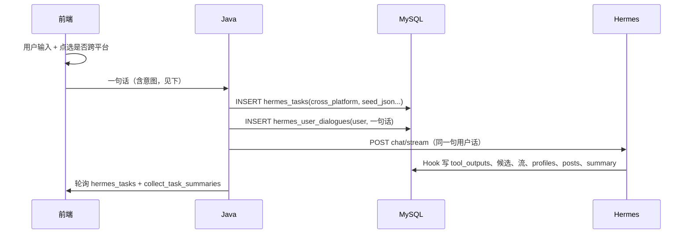

# 01 账号采集 · MySQL 表设计（Java / 前端首步版）

> 状态：**已落地**（2026-07-06）  
> SQL：`scripts/sql/003_init_collect_01.sql`  
> 库：`hermes-xa` @ `127.0.0.1:3306`

---

## 一、9 张表（无 `hermes_task_steps`）

| # | 表名 | 职责 |
|---|------|------|
| 1 | `hermes_tasks` | 总流程状态、`current_phase`、`cross_platform` |
| 2 | `hermes_user_dialogues` | 用户**一句话**及系统回复 |
| 3 | `hermes_tool_outputs` | MCP 完整原始 JSON |
| 4 | `cross_platform_candidates` | 跨平台候选（阶段 3） |
| 5 | `collect_identity_streams` | 文本流 / 图片流及校验（阶段 5～6） |
| 6 | `collect_validated_accounts` | 已校验账号清单（阶段 7） |
| 7 | `collect_profiles` | 人物资料（阶段 8） |
| 8 | `collect_posts` | 发文内容（阶段 8） |
| 9 | `collect_task_summaries` | 任务结果摘要 |

**首步点选**：由**前端**完成（是否跨平台），不落库 step 表。Java 收到用户**一句话**后写入 `hermes_tasks.cross_platform` 与 `hermes_user_dialogues`，再调 Hermes。

---

## 二、前端 → Java → Hermes 协作



### 用户一句话示例

前端把点选结果**拼进**发给 Java 的自然语言，例如：

```text
采集推特平台的李老师，需要跨平台采集
```

或：

```text
采集推特平台的李老师，仅采集当前平台
```

Java 解析或规则提取 `cross_platform=1/0`，写入 `hermes_tasks`，**原句**写入 `hermes_user_dialogues`，**原句**转发给 Hermes。

---

## 三、表结构摘要

### `hermes_tasks`

| 字段 | 说明 |
|------|------|
| `task_id` | PK，UUID |
| `task_type` | `account_collect` |
| `session_id` | Hermes 会话 |
| `status` | pending / running / completed / failed |
| `current_phase` | resolve_seed → … → done |
| `cross_platform` | 1=跨平台，0=仅当前平台 |
| `seed_json` | 种子账号解析结果 |

### `hermes_user_dialogues`

| 字段 | 说明 |
|------|------|
| `role` | user / assistant / system |
| `content` | 用户一句话或系统回复 |
| `msg_type` | user_input / assistant_reply / phase_progress / summary |

### `collect_profiles` / `collect_posts`

常用列 + `raw_json`，详见 [MySQL数据库设计.md §五](MySQL数据库设计.md)。

### `hermes_tool_outputs`

每次 MCP 调用一行，`tool_output` 为完整 JSON。

### `collect_task_summaries`

任务结束后写入：`profile_count`、`post_count`、`summary_text`、`summary_json` 等。

---

## 四、连接配置

`.env` 示例（勿提交真实密码到 Git）：

```env
HERMES_DB_HOST=127.0.0.1
HERMES_DB_PORT=3306
HERMES_DB_USER=root
HERMES_DB_PASSWORD=***
HERMES_DB_NAME=hermes-xa
```

建表：

```powershell
mysql -h 127.0.0.1 -P 3306 -u root -p --default-character-set=utf8mb4 -e "source d:/hermes-xa/scripts/sql/003_init_collect_01.sql"
```

已建表补中文注释：

```powershell
mysql -h 127.0.0.1 -P 3306 -u root -p --default-character-set=utf8mb4 -e "source d:/hermes-xa/scripts/sql/004_add_zh_comments.sql"
```

> 表与字段均含中文 `COMMENT`，可用 Navicat / DBeaver 查看；Windows 终端可能显示乱码，库内 UTF-8 正常。

---

## 五、相关文档

- [01-账号信息采集.md](workflows/01-账号信息采集.md)
- [normalizers架构设计.md](normalizers架构设计.md)
- [MySQL数据库设计.md](MySQL数据库设计.md)（全库参考）

---

*文档版本：2026-07-06 · 9 表已建*
