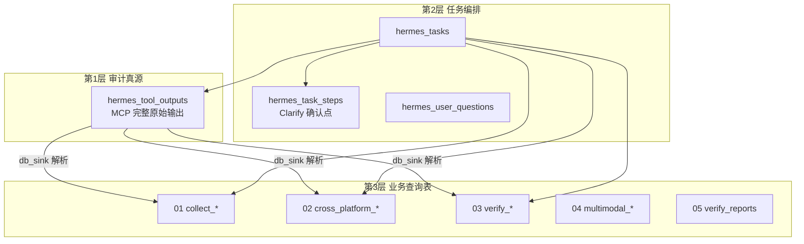
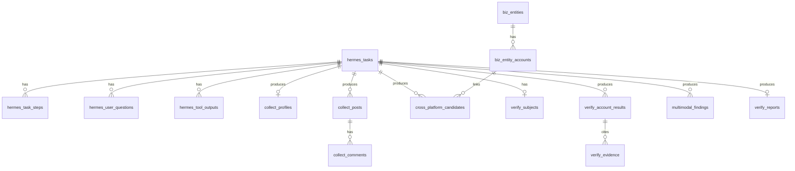
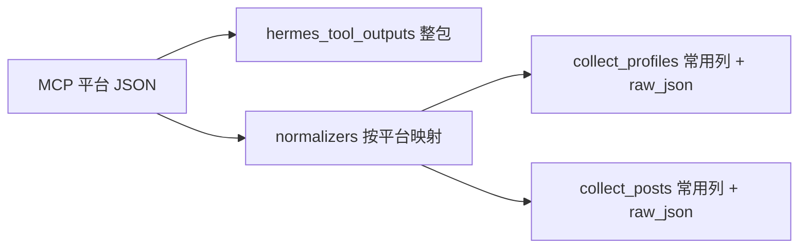

# MySQL 数据库设计

> 库名建议：`hermes-xa`  
> 字符集：`utf8mb4` / `utf8mb4_unicode_ci`  
> 版本：2026-07-06 v2（增补 01 采集：人物/发文分表 + 统一常用列 + raw_json）  
> 状态：**讨论稿**，与 `scripts/sql/002_init_business.sql` 部分字段存在差异，确认后出 `003_` 迁移脚本。

---

## 一、设计原则（方便改表）

### 1.1 三层存储，职责分离



| 层 | 表 | 用途 | 改表策略 |
|----|-----|------|----------|
| **审计** | `hermes_tool_outputs` | MCP 返回的完整 JSON，永不截断 | 几乎不改，只加索引 |
| **编排** | `hermes_tasks` / `hermes_task_steps` | 任务状态、Clarify 每一步 | 稳定字段少，扩展放 `subject_json` |
| **业务** | `collect_*` / `verify_*` 等 | Java 列表页、报告证据包 | **不确定的字段放 `extra_json`** |

### 1.2 改表友好的约定

| 约定 | 原因 |
|------|------|
| **不用 MySQL `ENUM`** | 改枚举要 `ALTER TABLE`，用 `VARCHAR(32)` + 文档约定 |
| **核心列 + `extra_json`** | 新字段先塞 JSON，稳定后再 `ALTER ADD COLUMN` |
| **按编号迁移脚本** | `scripts/sql/001_*.sql`、`002_*.sql`，可重复执行用 `IF NOT EXISTS` |
| **`task_id` 贯穿全库** | 五类业务都挂同一任务轴，跨 Skill 跳转不丢上下文 |
| **原始与解析分离** | `hermes_tool_outputs` 保留原文；业务表可删重建解析 |
| **时间用 `DATETIME(3)`** | 毫秒精度，方便对账 Hook 与 MCP 耗时 |

### 1.3 `task_type` 与五类业务映射

| task_type | 业务流程 | 主要业务表 |
|-----------|----------|------------|
| `collect` | 01 账号信息采集 | `collect_profiles`、`collect_posts` |
| `cross_platform` | 02 跨平台账号收集 | `cross_platform_candidates`、`biz_entity_accounts` |
| `verify` | 03 账号核查 | `verify_subjects`、`verify_account_results` |
| `multimodal` | 04 多模态分析 | `multimodal_findings` |
| `report` | 05 账号核查报告 | `verify_reports` |

`parent_task_id` 用于串联：01 → 02 → 03 → 04 → 05。

---

## 二、ER 关系总览



---

## 三、公共表（所有业务共用）

### 3.1 `hermes_tasks` — 任务主表

| 字段 | 类型 | 说明 |
|------|------|------|
| `task_id` | VARCHAR(64) PK | Java 生成 UUID |
| `task_type` | VARCHAR(32) | collect / cross_platform / verify / multimodal / report |
| `session_id` | VARCHAR(64) | Hermes `/api/sessions` 的 ID |
| `parent_task_id` | VARCHAR(64) | 上游任务，如 02 的 parent 是 01 |
| `status` | VARCHAR(16) | pending / running / waiting_user / completed / failed |
| `subject_json` | JSON | 本人参照、锚定账号、种子账号等（各业务不同） |
| `summary_json` | JSON | 任务结束后的统计摘要（条数、verdict 汇总等） |
| `error_message` | TEXT | 失败原因 |
| `created_by` | VARCHAR(64) | 操作人（Java 用户 ID，可选） |
| `created_at` | DATETIME(3) | |
| `updated_at` | DATETIME(3) | |

**`subject_json` 示例（按 task_type）：**

```json
// collect
{ "platform": "weibo", "account_handle": "@某某", "account_id": "123" }

// verify
{ "name": "张三", "anchor_account": { "platform": "weibo", "account_id": "111" } }

// cross_platform
{ "seed": { "platform": "weibo", "account_id": "123" } }
```

### 3.2 `hermes_task_steps` — Clarify / 确认点

| 字段 | 类型 | 说明 |
|------|------|------|
| `id` | BIGINT PK | |
| `task_id` | VARCHAR(64) | |
| `step_key` | VARCHAR(64) | 如 `collect.time_range`、`verify.evidence_mode` |
| `step_order` | INT | 第几步 |
| `source` | VARCHAR(16) | `clarify` / `java_ui` / `system_confirm` |
| `question` | TEXT | |
| `options_json` | JSON | 选项列表 |
| `user_choice` | TEXT | 用户最终选择 |
| `chosen_at` | DATETIME(3) | |
| `extra_json` | JSON | 扩展 |

> Java 方案 A（`[系统确认]`）与 Hermes 原生 `clarify` 都写这张表，前端轮询此表渲染进度条。

### 3.3 `hermes_user_questions` — 用户原始提问

| 字段 | 类型 | 说明 |
|------|------|------|
| `question_id` | VARCHAR(64) PK | |
| `task_id` | VARCHAR(64) | |
| `session_id` | VARCHAR(64) | |
| `user_question` | TEXT | 用户第一句话 |
| `asked_at` | DATETIME(3) | |

### 3.4 `hermes_tool_outputs` — MCP 原始输出（审计真源）

| 字段 | 类型 | 说明 |
|------|------|------|
| `id` | BIGINT PK | |
| `task_id` | VARCHAR(64) | |
| `question_id` | VARCHAR(64) | 可空 |
| `mcp_server` | VARCHAR(64) | 如 `weibo` |
| `tool_name` | VARCHAR(128) | 如 `mcp_weibo_get_profile` |
| `tool_args` | JSON | |
| `tool_output` | LONGTEXT | **完整 JSON，不截断** |
| `tool_call_id` | VARCHAR(128) UNIQUE | Hermes 工具调用 ID |
| `duration_ms` | INT | |
| `status` | VARCHAR(16) | success / error |
| `executed_at` | DATETIME(3) | |

### 3.5 `schema_migrations` — 迁移版本（可选）

记录已执行的 SQL 脚本编号，Java 或手工维护均可。

---

## 四、跨业务公共实体（02/03/05 共用）

### 4.1 `biz_entities` — 自然人 / 分析主体

| 字段 | 类型 | 说明 |
|------|------|------|
| `entity_id` | VARCHAR(64) PK | 如 `ent_abc123` |
| `display_name` | VARCHAR(128) | 显示名 |
| `created_at` | DATETIME(3) | |
| `extra_json` | JSON | |

### 4.2 `biz_entity_accounts` — 实体下的平台账号

| 字段 | 类型 | 说明 |
|------|------|------|
| `id` | BIGINT PK | |
| `entity_id` | VARCHAR(64) | |
| `platform` | VARCHAR(32) | weibo / bilibili / twitter … |
| `account_id` | VARCHAR(128) | 平台侧 ID |
| `account_handle` | VARCHAR(256) | @昵称 |
| `role` | VARCHAR(32) | seed / candidate / verified_self / verified_not_self |
| `profile_json` | JSON | 最新资料快照 |
| `extra_json` | JSON | |
| UNIQUE | (platform, account_id) | 防重复 |

---

## 五、01 账号信息采集（重点）

> 入库由 **Normalizer + Hook** 完成，不由模型拼 SQL。详见 [normalizers架构设计.md](normalizers架构设计.md)。

### 5.0 设计共识（讨论确定）

| 原则 | 说明 |
|------|------|
| **人物 / 发文分表** | `collect_profiles` 管「是谁」；`collect_posts` 管「发了什么」 |
| **统一常用列** | 跨平台语义接近的字段提成独立列，供 Java / 03 / 05 查询 |
| **每行 `raw_json`** | 该平台该条记录的原始对象，不必每个字段都建列 |
| **整包 `hermes_tool_outputs`** | 一次 MCP 调用的完整响应，与行级 `raw_json` 双保险 |
| **不全量映射** | Normalizer 只映射常用列；其余留在 `raw_json` |
| **快照不覆盖** | 同一 task 内人物资料为快照行，不原地 UPDATE 历史任务数据 |



#### 三层数据职责

| 层级 | 存什么 | 何时用 |
|------|--------|--------|
| `hermes_tool_outputs` | 一次 tool 调用的**完整** JSON | 审计、解析失败重跑 |
| 业务表常用列 | 统一信封字段 | 列表、筛选、报告证据引用 |
| 业务表 `raw_json` | **单行**对应的平台原对象 | 对账、补映射、深度分析 |

#### 互动指标约定

- `view_count` / `like_count` / `comment_count` / `repost_count` 放在 **发文表**，不放人物表  
- 平台无对应指标 → **NULL**（不填 0）  
- B 站投币等 → `metrics_json` 或 `raw_json`  
- **禁止**跨平台直接比较 `like_count` 绝对值（文档与 UI 需注明）

#### 评论怎么处理（待定）

- **方案 A（推荐前期）**：评论也进 `collect_posts`，`content_type=comment`，`parent_content_id` 指向博文  
- **方案 B**：评论量大时拆 `collect_comments`（`002` SQL 已预留，可暂不启用）

---

### 5.1 `collect_profiles` — 人物信息（账号资料快照）

**一行 = 某 `task_id` 下、某平台、某账号的一次资料快照。**

| 字段 | 类型 | 必填 | 说明 |
|------|------|------|------|
| `id` | BIGINT | PK | |
| `task_id` | VARCHAR(64) | ✓ | |
| `platform` | VARCHAR(32) | ✓ | weibo / bilibili / twitter … |
| `account_id` | VARCHAR(128) | ✓ | 平台内唯一 ID，**业务主键之一** |
| `account_handle` | VARCHAR(256) | | @名 / 自定义 ID |
| `display_name` | VARCHAR(256) | | 显示昵称 |
| `bio` | TEXT | | 简介 |
| `avatar_url` | VARCHAR(512) | | 头像 URL（03/04 会用） |
| `profile_url` | VARCHAR(512) | | 主页链接 |
| `follower_count` | BIGINT | | 粉丝数 |
| `following_count` | BIGINT | | 关注数 |
| `content_count` | BIGINT | | 内容总数（微博=博文，B站=投稿，语义见 extra） |
| `verified` | TINYINT(1) | | 是否认证 |
| `visibility` | VARCHAR(16) | | public / partial / unknown |
| `collect_status` | VARCHAR(16) | | success / empty / partial / error |
| `tool_output_id` | BIGINT | | → `hermes_tool_outputs.id` |
| `raw_json` | JSON | ✓ | **该账号资料在 MCP 中的原对象** |
| `collect_options_json` | JSON | | 本次采集条件（关键词、时间范围等，来自 task_steps） |
| `metrics_json` | JSON | | 人物级扩展指标（可选，一般少用） |
| `extra_json` | JSON | | 暂未提升的字段 |
| `collected_at` | DATETIME(3) | ✓ | 快照时间 |

**唯一约束（建议）**：`UNIQUE (task_id, platform, account_id)`

**与旧 SQL 差异**：`002` 中 `profile_json` 拟改为「常用列 + `raw_json`」，确认后迁移。

---

### 5.2 `collect_posts` — 发文信息（内容明细）

**一行 = 一条内容**（原创 / 转发 / 视频 / 文章 / 评论等，用 `content_type` 区分）。

| 字段 | 类型 | 必填 | 说明 |
|------|------|------|------|
| `id` | BIGINT | PK | |
| `task_id` | VARCHAR(64) | ✓ | |
| `platform` | VARCHAR(32) | ✓ | |
| `account_id` | VARCHAR(128) | ✓ | 作者账号 ID |
| `content_id` | VARCHAR(128) | ✓ | 平台内容 ID（`002` SQL 字段名暂为 `post_id`） |
| `content_type` | VARCHAR(32) | ✓ | post / repost / video / article / comment |
| `parent_content_id` | VARCHAR(128) | | 转发源帖 / 被评博文 |
| `title` | VARCHAR(512) | | 标题（B站、公众号等） |
| `content_text` | TEXT | | 正文（可截断，全文在 raw_json） |
| `content_url` | VARCHAR(512) | | 可访问链接（`002` 暂为 `post_url`） |
| `published_at` | DATETIME(3) | | 发布时间（`002` 暂为 `posted_at`） |
| `view_count` | BIGINT | | 浏览 / 播放 |
| `like_count` | BIGINT | | 点赞 |
| `comment_count` | BIGINT | | 评论数 |
| `repost_count` | BIGINT | | 转发 / 分享 |
| `media_json` | JSON | | `[{type, url, thumb}]` 统一结构 |
| `metrics_json` | JSON | | 投币等扩展互动指标 |
| `matched_keywords` | JSON | | 01 关键词筛选命中 |
| `text_truncated` | TINYINT(1) | | 正文是否截断 |
| `tool_output_id` | BIGINT | | 同一次 MCP 多条内容共用 |
| `raw_json` | JSON | ✓ | **该条内容在 MCP 中的原对象** |
| `extra_json` | JSON | | |
| `created_at` | DATETIME(3) | ✓ | 入库时间 |

**唯一约束（建议）**：`UNIQUE (task_id, platform, content_id)`

**`content_type` 枚举（代码常量，不用 DB ENUM）**：

| 值 | 含义 |
|----|------|
| `post` | 原创帖 / 主内容 |
| `repost` | 转发 / 转载 |
| `video` | 视频投稿 |
| `article` | 长文 / 公众号文章 |
| `comment` | 评论（前期可进本表） |

---

### 5.3 `collect_comments` — 评论（可选，后期启用）

评论字段与发文表高度重合。前期可用 `collect_posts` + `content_type=comment` 代替；评论量极大或查询模式不同时再启用本表。

结构与 `collect_posts` 类似：`comment_id`、`post_id`、作者、`content_text`、`raw_json` 等。

---

### 5.4 01 统一常用字段契约（Normalizer 输出）

人物表 **必填映射**（映射不到则 NULL，但 `platform` / `account_id` / `raw_json` 必须有）：

```
platform, account_id, account_handle, display_name, bio, avatar_url,
profile_url, follower_count, following_count, content_count, verified
```

发文表 **必填映射**：

```
platform, account_id, content_id, content_type, content_text,
published_at, tool_output_id, raw_json
```

发文表 **尽量映射**（无则 NULL）：

```
title, content_url, view_count, like_count, comment_count, repost_count,
media_json, parent_content_id, matched_keywords
```

---

### 5.5 01 入库流程（摘要）

```
post_tool_call
  → INSERT hermes_tool_outputs
  → registry 按 tool_name 选择 normalizer
  → normalize_profile / normalize_posts
  → INSERT collect_profiles / collect_posts
```

未注册 `tool_name`：仅写 `hermes_tool_outputs`，业务表跳过并打日志。  
完整说明见 [normalizers架构设计.md](normalizers架构设计.md)。

---

## 六、02 跨平台账号收集

### 6.1 `cross_platform_candidates` — 候选账号

| 字段 | 类型 | 说明 |
|------|------|------|
| `id` | BIGINT PK | |
| `task_id` | VARCHAR(64) | |
| `entity_id` | VARCHAR(64) | 可空，图谱生成后回填 |
| `platform` | VARCHAR(32) | |
| `account_id` | VARCHAR(128) | |
| `account_handle` | VARCHAR(256) | |
| `confidence` | DECIMAL(5,4) | 0～1 |
| `evidence_json` | JSON | `["nickname_match","same_bio_url"]` |
| `match_strategy` | VARCHAR(64) | maigret / nickname / bio_link |
| `status` | VARCHAR(16) | candidate / weak / excluded |
| `profile_json` | JSON | 简要资料 |
| `tool_output_id` | BIGINT | |
| `extra_json` | JSON | |

### 6.2 `cross_platform_seeds` — 种子账号（可选独立表）

若种子信息已在 `hermes_tasks.subject_json`，可不建此表；需要多种子时再拆出。

---

## 七、03 账号核查

### 7.1 `verify_subjects` — 本人参照（每任务一行）

| 字段 | 类型 | 说明 |
|------|------|------|
| `id` | BIGINT PK | |
| `task_id` | VARCHAR(64) UNIQUE | |
| `name` | VARCHAR(128) | |
| `anchor_platform` | VARCHAR(32) | |
| `anchor_account_id` | VARCHAR(128) | |
| `anchor_handle` | VARCHAR(256) | |
| `reference_photos_json` | JSON | 照片 file_id 列表 |
| `org_title` | VARCHAR(256) | 单位/职务 |
| `verify_options_json` | JSON | focus、evidence_mode 等 |
| `extra_json` | JSON | |

### 7.2 `verify_account_inputs` — 待核查账号清单

| 字段 | 类型 | 说明 |
|------|------|------|
| `id` | BIGINT PK | |
| `task_id` | VARCHAR(64) | |
| `platform` | VARCHAR(32) | |
| `account_id` | VARCHAR(128) | |
| `account_handle` | VARCHAR(256) | |
| `source` | VARCHAR(32) | manual / from_cross_platform / from_collect |
| `input_order` | INT | |
| UNIQUE | (task_id, platform, account_id) | |

### 7.3 `verify_account_results` — 逐账号判定

| 字段 | 类型 | 说明 |
|------|------|------|
| `id` | BIGINT PK | |
| `task_id` | VARCHAR(64) | |
| `platform` | VARCHAR(32) | |
| `account_id` | VARCHAR(128) | |
| `account_handle` | VARCHAR(256) | |
| `verdict` | VARCHAR(32) | self_authentic / not_self / impersonation_suspected / insufficient_data |
| `confidence` | DECIMAL(5,4) | |
| `summary` | TEXT | 一句话结论 |
| `user_override` | TINYINT(1) | 用户是否在确认点 E 手动改过 |
| `final_verdict` | VARCHAR(32) | 用户确认后的最终值 |
| `tool_output_id` | BIGINT | |
| `extra_json` | JSON | |
| UNIQUE | (task_id, platform, account_id) | |

**`verdict` 枚举**（代码常量，不入库 ENUM）：

| 值 | 含义 |
|----|------|
| `self_authentic` | 本人真实 |
| `not_self` | 非本人 |
| `impersonation_suspected` | 疑似冒充 |
| `insufficient_data` | 无法判定 |

### 7.4 `verify_evidence` — 证据条目

| 字段 | 类型 | 说明 |
|------|------|------|
| `evidence_id` | VARCHAR(64) PK | 如 `ev_001` |
| `task_id` | VARCHAR(64) | |
| `result_id` | BIGINT | 关联 `verify_account_results.id` |
| `evidence_type` | VARCHAR(32) | profile_match / photo_match / cross_follow / content_conflict |
| `description` | TEXT | |
| `source_ref_json` | JSON | post_id、tool_output_id、url 等 |
| `extra_json` | JSON | |

---

## 八、04 账号多模态分析

### 8.1 `multimodal_findings` — 分析发现（一条一行）

| 字段 | 类型 | 说明 |
|------|------|------|
| `id` | BIGINT PK | |
| `task_id` | VARCHAR(64) | |
| `platform` | VARCHAR(32) | |
| `account_id` | VARCHAR(128) | |
| `finding_type` | VARCHAR(32) | text_summary / image / cross_modal / video |
| `post_id` | VARCHAR(128) | 可空 |
| `media_url` | VARCHAR(512) | 可空 |
| `severity` | VARCHAR(16) | low / medium / high |
| `labels_json` | JSON | |
| `description` | TEXT | |
| `ocr_text` | TEXT | |
| `confidence` | DECIMAL(5,4) | |
| `tool_output_id` | BIGINT | |
| `extra_json` | JSON | analysis_options、depth 等 |

文本级汇总（main_topics、sentiment）可单独一行 `finding_type=text_summary`，或放 `hermes_tasks.summary_json`。

---

## 九、05 账号核查报告

### 9.1 `verify_reports` — 报告主表

| 字段 | 类型 | 说明 |
|------|------|------|
| `id` | BIGINT PK | |
| `task_id` | VARCHAR(64) UNIQUE | |
| `title` | VARCHAR(256) | |
| `template` | VARCHAR(32) | brief / standard / deep |
| `audience` | VARCHAR(32) | technical / business / external |
| `risk_level` | VARCHAR(16) | low / medium / high |
| `verdict_summary` | TEXT | |
| `sections_json` | JSON | 勾选了哪些章节 |
| `upstream_refs_json` | JSON | 关联的 collect/verify/multimodal task_id |
| `version` | INT | 修订递增 |
| `status` | VARCHAR(16) | draft / final |
| `created_at` | DATETIME(3) | |
| `extra_json` | JSON | |

### 9.2 `verify_report_contents` — 报告正文（版本化）

| 字段 | 类型 | 说明 |
|------|------|------|
| `id` | BIGINT PK | |
| `report_id` | BIGINT | |
| `version` | INT | |
| `format` | VARCHAR(16) | markdown / html / json |
| `content` | LONGTEXT | 正文 |
| `generated_at` | DATETIME(3) | |
| UNIQUE | (report_id, version, format) | |

> 历史版本保留在 `verify_report_contents`；`verify_reports.version` 指向当前最新。

---

## 十、表清单速查

| 分类 | 表名 | 张数 |
|------|------|------|
| 公共 | hermes_tasks, hermes_task_steps, hermes_user_questions, hermes_tool_outputs, schema_migrations | 5 |
| 实体 | biz_entities, biz_entity_accounts | 2 |
| 01 | collect_profiles, collect_posts, collect_comments | 3 |
| 02 | cross_platform_candidates | 1 |
| 03 | verify_subjects, verify_account_inputs, verify_account_results, verify_evidence | 4 |
| 04 | multimodal_findings | 1 |
| 05 | verify_reports, verify_report_contents | 2 |
| **合计** | | **18** |

---

## 十一、Hook `db_sink.py` 写入规则

| 事件 | 写入 |
|------|------|
| `pre_llm_call` | 解析 `X-Hermes-Session-Key: task:{id}` → upsert `hermes_tasks` |
| `post_tool_call` | INSERT `hermes_tool_outputs` → 调用 Normalizer → 写业务表（见 [normalizers架构设计.md](normalizers架构设计.md)） |
| clarify / `[系统确认]` | INSERT `hermes_task_steps`；`waiting_user` ↔ `running` 更新 tasks.status |
| `post_llm_call`（report Skill） | INSERT `verify_report_contents`；更新 `verify_reports` |

**tool_name → 业务表路由（示例）：**

| tool_name 前缀 | 目标表 |
|----------------|--------|
| `mcp_weibo_get_profile` 等 | `collect_profiles` |
| `mcp_weibo_get_feeds` 等 | `collect_posts` |
| `mcp_maigret_*` | `cross_platform_candidates` |
| vision / ocr 相关 | `multimodal_findings` |

解析失败时 **只写 `hermes_tool_outputs`**，不丢数据；业务表可事后补跑解析脚本。

---

## 十二、证据包 `evidence_builder` 读哪些表

按 `task_id`（及 `upstream_refs_json` 里的关联 task）组装：

```json
{
  "task_id": "uuid",
  "subject": "← verify_subjects",
  "collect_summary": "← collect_profiles + count(collect_posts)",
  "candidates": "← cross_platform_candidates",
  "verification": "← verify_account_results + verify_evidence",
  "multimodal": "← multimodal_findings",
  "steps": "← hermes_task_steps（用户当时选了什么）"
}
```

报告 Skill（05）**只读证据包**，禁止再调 MCP。

---

## 十三、改表操作指南

### 13.1 新增字段（推荐流程）

1. 先写入业务表 `extra_json`（零 DDL）
2. Java / 报告需要查询时，新增 `scripts/sql/00N_add_xxx.sql`：
   ```sql
   ALTER TABLE collect_posts ADD COLUMN sentiment VARCHAR(16) NULL COMMENT '情感倾向' AFTER content_text;
   ```
3. 回填历史：`UPDATE collect_posts SET sentiment = JSON_UNQUOTE(JSON_EXTRACT(extra_json,'$.sentiment')) WHERE ...`
4. 更新 `db_sink.py` 双写：列 + extra_json（过渡期）

### 13.2 新增一整类业务

1. `hermes_tasks.task_type` 加新字符串（无需改表）
2. 新建 `scripts/sql/00N_新业务.sql`
3. 在 `db_sink.py` 加路由
4. 补 workflow 文档「数据输出结构」

### 13.3 不建议

- 把 MCP 大 JSON 塞进业务列 — 用 `tool_output_id` 关联
- 用外键约束跨库任务 — 用 `task_id` 逻辑关联，删任务时 Java 或脚本级联清理
- 一张超级大表混五类业务 — 按 Skill 分表，查询更快

---

## 十四、Java 侧常用查询

```sql
-- 任务列表（按状态筛选）
SELECT task_id, task_type, status, created_at, updated_at
FROM hermes_tasks
WHERE status = 'waiting_user'
ORDER BY updated_at DESC;

-- 某任务的确认点进度
SELECT step_key, question, user_choice, chosen_at
FROM hermes_task_steps
WHERE task_id = ?
ORDER BY step_order;

-- 03 核查结果一览
SELECT platform, account_handle, final_verdict, confidence, summary
FROM verify_account_results
WHERE task_id = ?
ORDER BY id;

-- 报告最新版
SELECT r.title, r.verdict_summary, c.content
FROM verify_reports r
JOIN verify_report_contents c ON c.report_id = r.id AND c.version = r.version
WHERE r.task_id = ? AND c.format = 'markdown';
```

---

## 十五、相关文件

| 文件 | 说明 |
|------|------|
| [scripts/sql/001_init_core.sql](../scripts/sql/001_init_core.sql) | 公共表 + 实体表 |
| [scripts/sql/002_init_business.sql](../scripts/sql/002_init_business.sql) | 五类业务表（01 采集表待 `003` 对齐本文档） |
| [normalizers架构设计.md](normalizers架构设计.md) | **平台字段映射与入库管线** |
| [平台总览与框架设计.md](平台总览与框架设计.md) | 架构与 Hook |
| [clarify深度交互与Skill集成指南.md](clarify深度交互与Skill集成指南.md) | task_steps 与 Java 对接 |
| [workflows/01-账号信息采集.md](workflows/01-账号信息采集.md) | 01 业务流程 |

---

## 十六、待确认项（微调清单）

| # | 项 | 选项 |
|---|-----|------|
| 1 | 评论存储 | `collect_posts`+comment 类型 vs 独立 `collect_comments` |
| 2 | 字段命名 | `content_id` / `post_id`，`published_at` / `posted_at` 是否与 SQL 统一 |
| 3 | Profile 历史 | 仅 task 快照 vs 全局账号最新视图（视图或冗余表） |
| 4 | `entity_id` | 01 阶段是否挂实体，或等 02 再挂 |
| 5 | 首批 Normalizer | 微博 + B 站优先，其余先只落 `hermes_tool_outputs` |

---

*文档版本：2026-07-06 v2*
