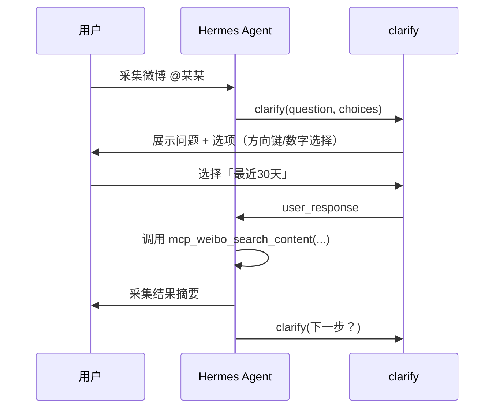
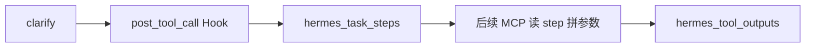
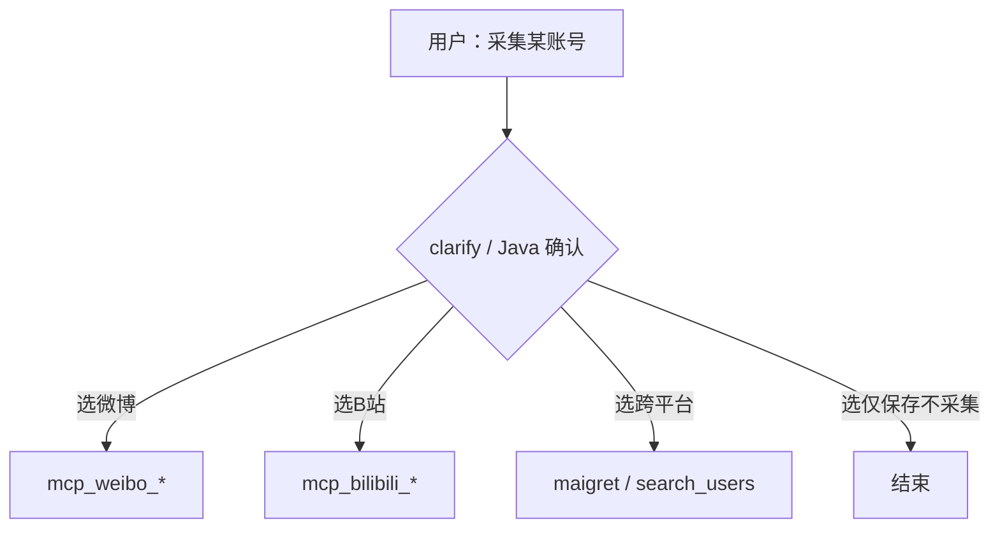
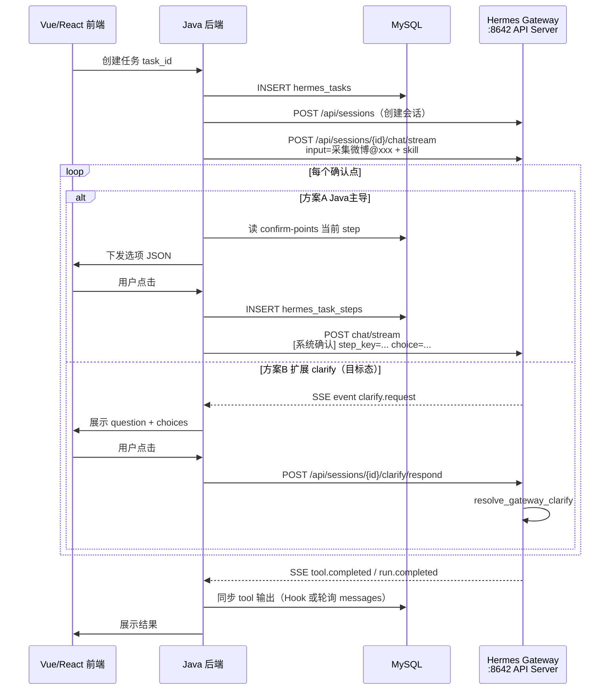
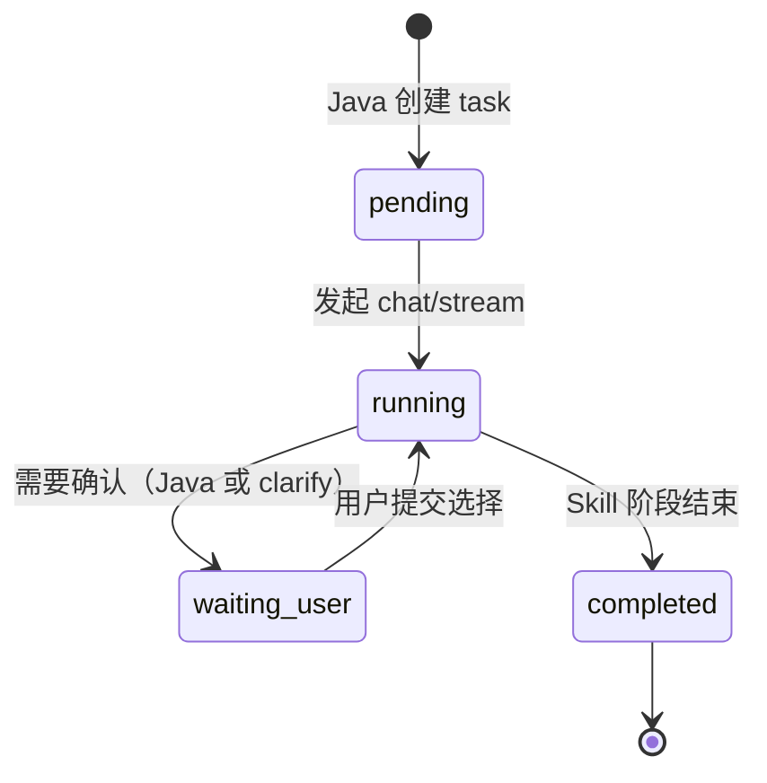

# Clarify 深度交互 — 功能详解与 Skill 集成指南

> **定位**：本项目最大亮点 —— 复刻「密塔 AI 深度模式」的 **先选后执行**。  
> 技术载体：Hermes 内置工具 **`clarify`**。  
> 读者：零基础可懂；实施者可直接照抄 Skill 模板。

相关文档：[平台总览与框架设计.md](平台总览与框架设计.md) · [workflows/](workflows/)

---

## 一、Clarify 是什么？

### 1.1 一句话

**Clarify = 让 AI 在继续干活之前，先向你提一个结构化问题，等你选完再继续。**

普通聊天：模型可能一口气调 10 个 MCP、猜你的意图、跑完才说结果。  
Clarify 模式：每个关键节点 **停下来 → 问你 → 你点选 → 再执行下一步**。

```
❌ 没有 clarify          ✅ 有 clarify（我们的模式）

用户：采微博账号           用户：采微博账号
  ↓                          ↓
模型直接 web_search        clarify：是否按关键词？[是/否]
  ↓                          ↓ 用户选「是」
猜参数、乱调工具           clarify：时间范围？[7天/30天/自定义]
  ↓                          ↓ 用户选「30天」
结果不可控                 调用 mcp_weibo_*，参数明确
```

### 1.2 和「普通对话」的区别

| | 普通 assistant 文本提问 | `clarify` 工具 |
|--|-------------------------|----------------|
| 形式 | 模型在回复里写「请选择 1/2/3」 | 专用 UI：可点击选项 |
| 是否阻塞 | 不阻塞，模型可能继续往下编 | **阻塞**：不收到你的答案不继续 |
| 结构化 | 靠用户打字，易解析失败 | 返回 JSON：`user_response` |
| 入库 | 难对齐确认点 | 可映射到 `hermes_task_steps` |

### 1.3 在 Hermes 里的位置

```
Hermes Agent
├── 内置工具（始终在 /tools 里）
│   ├── terminal / read_file / ...
│   └── clarify  ← 本项目核心交互工具
├── MCP 工具（微博、Twitter…，可能走 tool_search）
└── Skill（规定何时必须用 clarify、何时才能调 MCP）
```

`clarify` 属于 **Hermes 核心工具**，不会被 Tool Search 延迟加载，**永远直接可用**。

---

## 二、Clarify 怎么工作？（机制）

### 2.1 工具参数

模型调用 `clarify` 时传入：

| 参数 | 必填 | 说明 |
|------|------|------|
| `question` | 是 | **只写问题本身**，不要把选项写在问题里 |
| `choices` | 否 | 最多 **4 个** 字符串选项；不传则为开放式填空 |

**UI 行为**：

- 有 `choices`：展示 4 个可选项 + 第 5 个 **「Other（自行输入）」**
- 无 `choices`：等你自由输入一段文字

**返回 JSON 示例**：

```json
{
  "question": "采集时间范围？",
  "choices_offered": ["最近7天", "最近30天", "最近90天", "自定义日期"],
  "user_response": "最近30天"
}
```

### 2.2 正确 vs 错误写法

```text
✅ 正确
question: "是否按关键词筛选博文？"
choices: ["是，只采与事件相关的", "否，按时间全量采集"]

❌ 错误（选项写在 question 里，UI 无法点选）
question: "是否按关键词？1)是 2)否"
choices: []
```

### 2.3 运行流程（CLI）



### 2.4 重要约束

| 约束 | 说明 |
|------|------|
| **一次一问** | 每个 `clarify` 只问一件事；多个决策要 **连续多次调用** |
| **不能并行** | `clarify` 与别的工具 **不能同一轮同时调** |
| **阻塞等待** | Agent 线程暂停，直到你作答或超时 |
| **超时** | `config.yaml` → `agent.clarify_timeout`（默认 3600 秒） |
| **API Server** | 无交互用户的 API 模式 **不提供** `clarify`；Java 联调需走 Gateway 或自研选项 API |

### 2.5 各端体验

| 终端 | 交互方式 |
|------|----------|
| **CLI** (`hermes chat`) | 终端内选项列表，方向键或数字选择 |
| **Telegram / Discord** | 内联按钮，点选作答 |
| **Web Dashboard** | 与 TUI 一致，内嵌 clarify 提示 |
| **纯 API** | 需自行实现「下发选项 → 回传 user_response」 |

---

## 三、为什么这是我们项目的亮点？

| 密塔深度模式 | 我们的实现 |
|--------------|------------|
| 先理解任务 | Skill 解析用户意图 |
| 展示计划/分支 | `clarify` 的 `choices` |
| 用户确认后执行 | 确认后才允许 MCP |
| 阶段结果 + 下一步 | 循环 clarify → MCP → clarify |
| 全程可审计 | 每步写入 `hermes_task_steps` |

**价值**：

1. **可控**：采集范围、平台、数量由人定，不靠模型猜  
2. **可复现**：同一选项 = 同一执行路径  
3. **可对接前端**：`question + choices` 直接渲染为表单/按钮  
4. **省上下文**：不必在对话里反复解释已确认参数（可从库读）  

---

## 四、融入 5 类 Skill 流程

### 4.1 总原则（写进每个 SKILL.md 的硬性规则）

```markdown
## Clarify 强制规则

1. 进入本 Skill 后，**第一个工具调用**必须是 `clarify`（除非用户已在指令中写明全部参数）。
2. 每个「确认点」（见 workflows/0x-*.md）对应 **至少一次** `clarify`。
3. **用户未确认前，禁止调用任何 MCP 工具**（含 tool_search → tool_call）。
4. 收到 `clarify` 返回后，若还有未决确认点，**下一条动作仍是 clarify**，不要先长篇解释。
5. 所有 MCP 调用使用的参数，必须来自已确认的 `user_response` 或已入库的 `task_step`。
6. 完成一个阶段后，用 `clarify` 提供「下一步」选项（跳转其他 Skill / 结束 / 调整重跑）。
```

### 4.2 五类 Skill 的 Clarify 检查点映射

| Skill | 必须用 clarify 的节点 | 确认通过后才允许的 MCP |
|-------|----------------------|------------------------|
| **01 账号信息采集** | 关键词？时间？数量？下一步？ | weibo / bilibili / twitter / youtube 等内容类 |
| **02 跨平台收集** | 搜哪些平台？匹配策略？下一步？ | maigret、search_users |
| **03 账号核查** | 本人参照信息？核查范围？侧重点？证据方式？接受分类？ | get_profile 等轻量查询 |
| **04 多模态分析** | 分析范围？模态？目标？深度？ | ocr、vision、视频类 |
| **05 核查报告** | 报告类型？章节？受众？格式？发布？ | **禁止任何 MCP** |

详细确认点文案见各 [workflows/0x-*.md](workflows/)。

### 4.3 Clarify 与 MCP 的协作模式

三种典型模式：

#### 模式 A：执行前确认（最常用）

```
clarify(采不采关键词？) → clarify(时间范围) → MCP 采集
```

#### 模式 B：MCP 前选择平台/工具

在 **多平台** 场景，先让用户选渠道，再 `tool_search` 或直接调对应 MCP：

```
clarify(
  question: "从哪个平台采集该账号？",
  choices: ["微博", "B站", "Twitter", "先跨平台搜索"]
)
→ 用户选「微博」
→ tool_call("mcp_weibo_get_profile", {...})
```

#### 模式 C：MCP 后分支（结果驱动）

```
MCP 返回候选列表（只读展示，不 clarify 逐条）
→ clarify(
    question: "检索到 3 个候选账号，接下来？",
    choices: ["送入账号核查", "采集其中部分", "仅保存列表", "调整策略重搜"]
  )
```

> **02 跨平台** 已取消「逐条确认候选」；候选展示后只用 **一次 clarify** 选下一步，符合模式 C。

---

## 五、Skill 模板示例

### 5.1 01 账号信息采集 — SKILL 片段

```markdown
---
name: account-collect
description: Use when user wants to collect social account data. Enforces clarify-before-MCP deep mode.
---

## 执行顺序

### Step 1 — 解析账号
从用户消息提取 platform、account_id。若缺失，clarify 开放式提问补全。

### Step 2 — 确认点 A（关键词）
调用 clarify：
- question: "是否只采集与特定关键词相关的内容？"
- choices: ["是，按关键词筛选", "否，按时间范围尽量全量"]

若 user_response 以「是」开头 → Step 2b 开放式 clarify 收集关键词（逗号分隔）。
否则 → 跳过 Step 2b。

### Step 3 — 确认点 C（时间）
调用 clarify：
- question: "采集时间范围？"
- choices: ["最近7天", "最近30天", "最近90天", "自定义（下一问输入日期）"]

若用户选「自定义」→ 再一次开放式 clarify 要起止日期。

### Step 4 — 确认点 D（数量）
调用 clarify：
- question: "最多采集多少条主内容？"
- choices: ["20条", "50条", "100条", "自定义数量"]

### Step 5 — 执行 MCP（仅此步可调用 MCP）
根据 platform 映射工具：
- weibo → mcp_weibo_get_profile + mcp_weibo_search_content / get_feeds
参数必须来自 Step 2–4 的 user_response。

禁止：web_search、未确认即采集。

### Step 6 — 确认点 E（下一步）
clarify：
- choices: ["跨平台收集", "账号核查", "调整条件重采", "结束"]

## 完成标准
- 至少 4 次 clarify 已执行且 MCP 已返回
- 向用户展示采集摘要（条数、平台、时间范围）
```

### 5.2 MCP 流转时让用户选择 — 完整对话示例

```text
用户：帮我采一下 @浏阳网友 的微博

Agent clarify：是否按关键词筛选？
  [1] 是  [2] 否
用户：1

Agent clarify：请输入关键词（逗号分隔），或选常用包：
  [1] 烟花厂,浏阳,爆炸  [2] 我自己输入
用户：1

Agent clarify：时间范围？
  [1] 7天  [2] 30天  [3] 90天  [4] 自定义
用户：2

Agent clarify：最多采多少条博文？
  [1] 20  [2] 50  [3] 100
用户：2

Agent：（调用 mcp_weibo_*）… 完成，共 23 条。

Agent clarify：接下来？
  [1] 跨平台找其他平台账号  [2] 批量核查是否本人  [3] 结束
用户：2
→ 加载 account-verify-batch Skill
```

---

## 六、与入库（MySQL）联动

每次 `clarify` 返回后，Hook 应写入 `hermes_task_steps`：

| 字段 | 来源 |
|------|------|
| `step_key` | 如 `collect.keyword_confirm` |
| `question` | clarify 返回的 `question` |
| `options_json` | `choices_offered` |
| `user_choice` | `user_response` |
| `chosen_at` | 当前时间 |

**好处**：

- 刷新页面 / 新开会话可从库 **恢复进度**  
- Java 前端轮询 `hermes_task_steps` 渲染 **与 CLI 相同的选项**  
- 报告阶段引用「用户当时选了什么」有据可查  



---

## 七、FAQ：选项能否自定义？如何定规则？

### 7.1 简短回答

**可以。** 但要分清两层：

| 层级 | 谁生成选项 | 自定义程度 |
|------|------------|------------|
| **Hermes `clarify` 工具** | 模型调用工具时填入 `question` + `choices` | 由 **Skill / 规则** 约束模型「必须用什么选项」 |
| **Java 自研前端** | 你们自己的配置 / 数据库 | **完全自定义** UI 与选项，不依赖模型措辞 |

我们项目的最佳实践：**业务选项以配置文件为真源**，Skill 要求模型原样使用；前端也可直接读同一份配置渲染按钮。

### 7.2 Hermes clarify 的技术边界

来自 `clarify_tool.py` 的硬限制：

| 限制 | 值 |
|------|-----|
| `choices` 最多 | **4 个**（UI 自动加第 5 个「Other 自行输入」） |
| `question` | 必填，且 **不应** 把选项编号写进 question 正文 |
| 开放式 | 不传 `choices` → 用户自由输入 |
| 并行 | `clarify` **不能** 与 MCP 等同轮并行 |

选项的 **文案** 由模型在调用 `clarify` 时生成，但我们可以通过 Skill 规定它 **只能** 从允许列表里选。

### 7.3 四级自定义方式（由弱到强）

#### 级别 1：Skill 硬编码（推荐起步）

在 `SKILL.md` 写明每个 `step_key` 的固定选项，要求 **逐字使用**：

```markdown
### 确认点 collect.time_range
必须调用 clarify，且 choices 必须为以下四项（顺序一致）：
- "最近7天"
- "最近30天"
- "最近90天"
- "自定义日期"
禁止自行发明其他措辞。
```

模型仍有小概率偏离 → 靠级别 2、3 兜底。

#### 级别 2：确认点配置文件（推荐量产）

在 Skill 目录放 `references/confirm-points.yaml`：

```yaml
collect:
  time_range:
    question: "采集时间范围？"
    choices:
      - "最近7天"
      - "最近30天"
      - "最近90天"
      - "自定义日期"
  quantity:
    question: "最多采集多少条主内容？"
    choices: ["20条", "50条", "100条", "自定义数量"]

verify:
  evidence_mode:
    question: "证据获取方式？"
    choices:
      - "仅用已有数据"
      - "自动拉取公开资料"
      - "存疑账号补充采集"
```

Skill 规定：每到一个 `step_key`，先 `skill_view` 读该文件，再 **原样** 填入 `clarify`。

#### 级别 3：Hook 校验（规则引擎）

在 `post_tool_call` Hook 中，若工具名为 `clarify`：

1. 解析 `step_key`（可由 Skill 要求在 question 前缀加 `[step:collect.time_range]`，或由会话状态推断）
2. 读取 `confirm-points.yaml` 中允许的 `choices`
3. 若模型提交的 `choices_offered` 与允许列表不一致 → 写入日志 / 返回纠错提示（需扩展 Hook 或与 Java 联动驳回）

这样实现 **「在一定范围内给规则」**：选项池固定，模型只负责选哪一组、何时问。

#### 级别 4：Java 完全接管 UI（推荐生产环境）

**前端不展示 Hermes 吐出的自然语言选项**，而是：

1. Java 根据 `task_type` + 当前 `step_key` 读配置 / MySQL
2. 渲染自定义按钮（可超过 4 个、可带图标、可多级表单）
3. 用户点击后，Java 写入 `hermes_task_steps.user_choice`
4. Java 向 Hermes 发下一条消息，例如：

```text
[系统确认] step_key=collect.time_range user_choice=最近30天
```

Skill 规定：收到 `[系统确认]` 前缀则 **视为 clarify 已答**，直接进入下一步，不再调用 `clarify`。

此模式下 **交互体验完全自定义**；Hermes 侧 clarify 主要用于 CLI 本地调试。

### 7.4 MCP 流转时让用户选择调用哪个 MCP

在调用 MCP **之前** 增加一层 clarify（或 Java 等价确认）：



**Skill 规则示例**：

```markdown
## MCP 门禁
- 未出现 step_key=collect.platform 的已确认选择前，禁止 tool_search / tool_call。
- platform=weibo 时，只允许：mcp_weibo_get_profile, mcp_weibo_search_content, mcp_weibo_get_feeds
- platform=bilibili 时，只允许：mcp_bilibili_get_user_info, mcp_bilibili_search_videos
```

选项自定义示例：

```yaml
collect:
  platform:
    question: "从哪个平台采集？"
    choices:
      - "微博"
      - "B站"
      - "Twitter"
      - "先跨平台搜索"
```

### 7.5 小结（疑问 1）

| 问题 | 答案 |
|------|------|
| 选项能自定义吗？ | 能；Skill 硬编码 / YAML 配置 / Hook 校验 / Java UI 四级方案 |
| 能定规则吗？ | 能；用 `confirm-points.yaml` + `step_key` 枚举 + Skill 门禁 |
| MCP 前能让用户选吗？ | 能；在 MCP 前增加 `collect.platform` 等确认点 |
| 谁真源？ | 推荐 **`confirm-points.yaml` + `hermes_task_steps` 表**，CLI 与 Web 共用 |

---

## 八、FAQ：与 Java 前端如何打通？

### 8.1 简短回答

- **CLI / Telegram**：Hermes 原生支持 `clarify`，点选即继续。  
- **Java 自研 Web**：需要 **Sessions API + SSE** 订阅事件，并在用户点击后 **把答案送回 Hermes**；当前版本 API Server **尚未内置** clarify 回调，需按下面 **方案 B** 扩展，或先用 **方案 A（Java 主导确认）**。

### 8.2 当前 Hermes 各通道能力

| 通道 | clarify 支持 | 适合 |
|------|--------------|------|
| `hermes chat`（CLI） | ✅ 完整 | 开发调试 |
| Telegram / Discord 等 Gateway | ✅ 按钮 + `clarify_id` | 消息端 |
| API Server `POST /api/sessions/{id}/chat/stream` | ⚠️ **暂无 clarify 事件**（v0.18） | Java 需扩展或方案 A |
| OpenAI 兼容 `/v1/chat/completions` 无状态 | ❌ 无 clarify | 不适合深度模式 |
| TUI Gateway WebSocket `clarify.respond` | ✅ | 桌面端/Dashboard 内置 |

依据：`api_server` 创建 `AIAgent` 时 **未注入 `clarify_callback`**；`toolsets` 中 `api_server` 平台 **不含** `clarify` 工具。  
参考：`hermes-agent/gateway/platforms/api_server.py`、`hermes-agent/toolsets.py`（api_server 工具集说明）。

### 8.3 推荐总体架构（Java + Hermes）



### 8.4 方案 A：Java 主导确认（**现在就能做**）

不依赖 Hermes 的 `clarify` 工具，由 **Java + 前端** 完成密塔式交互，Hermes 只负责 **执行 MCP 与推理**。

**步骤：**

1. **启用 API Server**（`.env`）：
   ```env
   API_SERVER_ENABLED=true
   API_SERVER_HOST=127.0.0.1
   API_SERVER_PORT=8642
   API_SERVER_KEY=你的密钥
   ```
   启动：`hermes gateway`

2. **Java 创建会话并开流**：
   ```http
   POST /api/sessions
   Authorization: Bearer {API_SERVER_KEY}

   POST /api/sessions/{session_id}/chat/stream
   Content-Type: application/json
   X-Hermes-Session-Key: task:{task_id}

   {"input": "/account-collect 采集微博 @某某", "instructions": "..."}
   ```

3. **Java 读 SSE 事件**（已有）：`run.started`、`tool.started`、`tool.completed`、`assistant.delta`、`run.completed`

4. **确认点由 Java 拦截**：
   - 在首次 `chat/stream` **之前或之后**，Java 根据 workflow 状态机展示选项（读 `confirm-points.yaml` 或 DB）
   - 用户点击 → Java 写 `hermes_task_steps` → Java 再发一轮 `chat/stream`：
     ```json
     {"input": "[系统确认] step_key=collect.time_range user_choice=最近30天。请继续执行 account-collect Skill，不要重复询问此步。"}
     ```

5. **Skill 配合**：识别 `[系统确认]` 前缀，跳过对应 `clarify`，直接按 `user_choice` 调 MCP。

**优点**：不修改 Hermes 源码；前端 100% 自定义。  
**缺点**：确认逻辑在 Java 与 Skill 各有一部分，要维护状态机同步。

### 8.5 方案 B：扩展 API Server 支持 clarify（**目标态，与 CLI 一致**）

对齐 Gateway 已有实现（`gateway/run.py` + `tools/clarify_gateway.py`）：

| 待扩展项 | 说明 |
|----------|------|
| `AIAgent` 注入 `clarify_callback` | 注册 `clarify_id`，阻塞等待用户作答 |
| SSE 增加事件 | `event: clarify.request`，body 含 `clarify_id`、`question`、`choices`、`session_id` |
| 新增 REST | `POST /api/sessions/{session_id}/clarify/respond` |
| 请求体 | `{"clarify_id": "abc123", "answer": "最近30天"}` |
| 内部调用 | `resolve_gateway_clarify(clarify_id, answer)` 解除 Agent 阻塞 |
| 启用 clarify 工具集 | 让 `api_server` 平台包含 `clarify` toolset |

**Java 流程：**

```text
1. POST /api/sessions/{id}/chat/stream  （开启 SSE 长连接）
2. 收到 clarify.request → 前端渲染按钮
3. 用户点击 → POST /api/sessions/{id}/clarify/respond
4. Agent 线程收到 answer，继续 tool_call / 下一轮 clarify
5. 收到 run.completed → 关闭本轮
```

**与 `approval` 对齐**：API Server 已对危险命令实现 `approval.request` + `POST /v1/runs/{run_id}/approval`；clarify 可 **照抄同一模式**，只是会话级而非 run 级。

TUI Gateway 已有参考：`clarify.request` 事件 + `clarify.respond` JSON-RPC（`tui_gateway/server.py`）。

### 8.6 方案 C：仅 CLI 调试 + 生产全 Java UI

| 环境 | 确认交互 | 执行 |
|------|----------|------|
| 开发 | `hermes chat` + 原生 clarify | 验证 Skill / MCP |
| 生产 | Java 前端 + 方案 A 或 B | Hermes API Server |

### 8.7 数据与状态同步（Java 必做）

无论 A/B，Java 都应维护：

| 表 / 接口 | 用途 |
|-----------|------|
| `hermes_tasks.status` | `waiting_user` / `running` / `completed` |
| `hermes_task_steps` | 每个确认点的 question、options、user_choice |
| `GET /api/sessions/{id}/messages` | 审计完整对话与 tool 轨迹 |
| Hook `post_tool_call` | 自动落库 `hermes_tool_outputs` |

前端轮询建议：

```http
GET /api/java/tasks/{task_id}/steps        ← 自研 Java API，读 MySQL
GET /api/sessions/{session_id}/messages    ← Hermes 会话审计
```

### 8.8 任务状态机（前后端共识）



### 8.9 小结（疑问 2）

| 问题 | 答案 |
|------|------|
| 前端点击后怎么到 Hermes？ | 方案 A：Java 再 `POST chat/stream` 带 `[系统确认]`；方案 B：`POST clarify/respond` |
| 现在能直接用吗？ | 方案 A 可以；原生 clarify 走 API 需方案 B 扩展 |
| session 用什么？ | `task_id` 业务主键；`session_id` 对应 Hermes `/api/sessions` |
| 参考实现？ | Gateway `clarify_gateway.py`、TUI `clarify.respond`、API `approval` 同模式 |

---

## 九、配置与开关

### 9.1 确保 clarify 已启用

`config.yaml` 的 `toolsets` 中应包含 `clarify`（默认已有）：

```yaml
toolsets:
  - hermes-cli   # 内含 clarify
```

### 9.2 超时

```yaml
agent:
  clarify_timeout: 600   # 秒，用户多久不答则自动继续
```

业务确认点建议 **600～1800 秒**；过短会导致用户还没选好 Agent 就擅自继续。

### 9.3 不要让模型绕过 clarify

在 Skill 中明确写：

```markdown
禁止用普通 assistant 消息代替 clarify 提问。
禁止在 clarify 之前调用 tool_search / tool_call / mcp_*。
```

可在 `SOUL.md` 或 Skill 顶部加一句全局约束。

---

## 十、反模式（避免）

| 反模式 | 为什么不好 | 正确做法 |
|--------|------------|----------|
| 在回复里写「请回复 1 或 2」 | 不阻塞，模型可能继续调工具 | 必须 `clarify` |
| 一次 clarify 塞 5 个问题 | 超 4 选项限制，用户懵 | 拆成多次 clarify |
| 选项写在 question 正文里 | UI 无法点选 | 选项只放 `choices` |
| 未确认就 `tool_search` | 参数失控 | Skill 硬性禁止 |
| clarify 和 MCP 同一轮并行 | Hermes 不允许 | 先 clarify，下一轮再 MCP |
| 每个候选账号都 clarify | 02 已取消；太慢 | 批量展示 + 一次选下一步 |
| 报告阶段还用 clarify 问大段开放问题 | 应用证据包，选项应封闭 | 05 用封闭选项 + draft 会话 |

---

## 十一、和 Tool Search（MCP 按需加载）的关系

- `clarify`：**始终可见**  
- MCP（169 个）：可能在 `tool_search` 后面  

**推荐 Skill 写法**：

```text
1. clarify 确认平台/动作
2. tool_search("weibo profile")   ← 仅在 clarify 之后
3. tool_describe / tool_call
```

这样 **交互决策** 不依赖模型是否记得住 169 个工具名。

若团队希望模型直接看到 `mcp_weibo_*`，可在 `config.yaml` 关闭 `tools.tool_search.enabled`（见 [平台总览](平台总览与框架设计.md) 第三节）。

---

## 十二、实施 checklist

- [ ] 编写 `skills/account-intelligence/*/references/confirm-points.yaml`
- [ ] 5 个 Skill 的 `SKILL.md` 写入 Clarify 强制规则 + `[系统确认]` 协议（方案 A）
- [ ] 每个确认点对应 `step_key` 枚举（与 workflows 一致）
- [ ] `scripts/db_sink.py` 识别 `clarify` / `[系统确认]` 写入 `hermes_task_steps`
- [ ] `hermes_tasks.status` 在等待用户时置 `waiting_user`
- [ ] Java：`POST /api/sessions` + `chat/stream` SSE 消费
- [ ] （可选）扩展 API Server：`clarify.request` + `clarify/respond`（方案 B）
- [ ] 用 CLI 走通全流程；用 Java 走通方案 A

---

## 十三、速查

| 我想… | 怎么做 |
|-------|--------|
| 固定选项文案 | `confirm-points.yaml` + Skill 原样使用 |
| Java 自定义按钮 | 方案 A：Java 渲染，回传 `[系统确认]` |
| 原生 clarify 进 Java | 方案 B：扩展 SSE + `clarify/respond` |
| MCP 前让用户选平台 | `step_key=collect.platform` 确认点 |
| 让用户二选一/多选一（CLI） | `clarify(question, choices=[...])` |
| 让用户输入日期/关键词 | `clarify(question)` 不传 choices |
| 改等待时间 | `agent.clarify_timeout` |
| 看实现源码 | `clarify_tool.py`、`clarify_gateway.py` |

---

## 十四、相关链接

- [平台总览与框架设计.md](平台总览与框架设计.md) — 架构与入库  
- [01～05 workflows](workflows/) — 各业务确认点定义  
- Hermes API Server：`hermes-agent/website/docs/user-guide/features/api-server.md`  
- Hermes 源码：`clarify_tool.py`、`clarify_gateway.py`、`gateway/run.py`  
- Telegram/Discord clarify 按钮：`hermes-agent/website/docs/user-guide/messaging/`

---

*文档版本：2026-07-03（增补 FAQ：选项自定义 & Java 对接）*
