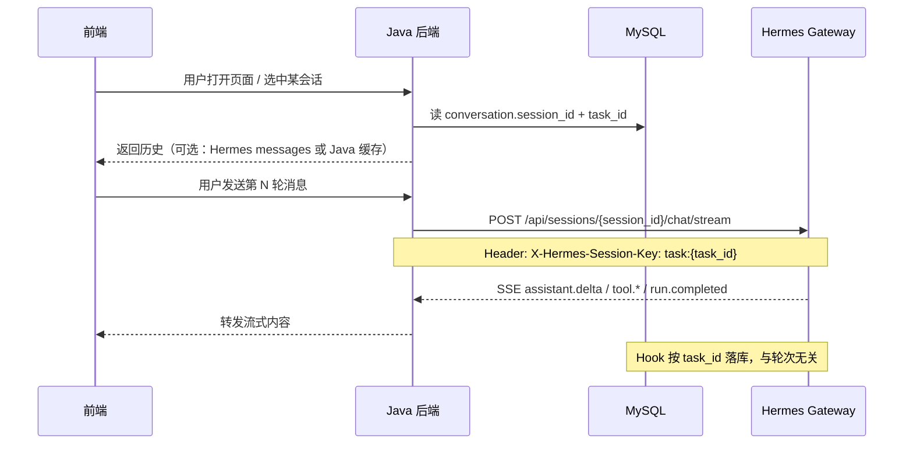
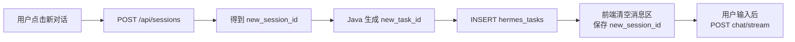

# Gateway 会话与多轮对话指南

> 面向 Java + 前端对接 Hermes API Server（`hermes gateway`）时，关于 **session_id**、多轮上下文、以及「新对话」的约定说明。  
> 相关文档：[clarify深度交互与Skill集成指南.md](clarify深度交互与Skill集成指南.md) §8 · [平台总览与框架设计.md](平台总览与框架设计.md) §5.2

---

## 一、两个 ID 不要混用

| 字段 | 谁生成 | 存在哪 | 作用 |
|------|--------|--------|------|
| **`session_id`** | Hermes `POST /api/sessions` | Hermes 进程内 SessionDB + 建议写入 `hermes_tasks.session_id` | **对话线程**：多轮聊天上下文、工具调用历史由 Hermes 按 session 维护 |
| **`task_id`** | Java 或 Hook 首次入库时 | MySQL `hermes_tasks` 主键 | **业务任务**：采集步骤、MCP 落库、`collect_*` 分表都挂在这个 ID 上 |

简要关系：

```
一个网页「对话」= 一个 session_id（Hermes 记上下文）
一次采集任务   = 一个 task_id（MySQL 记业务数据）

通常：1 个对话线程对应 1 个 task_id
多轮追问：同一个 session_id 反复 POST chat/stream
新对话：  新的 session_id（+ 通常新的 task_id）
```

---

## 二、问题 1：网页版多轮对话，要不要在数据库里存 session_id？

### 结论：**要存，而且项目里已经预留了字段**

MySQL 表 `hermes_tasks` 已有 `session_id` 列（见 `scripts/sql/003_init_collect_01.sql`），Hook 入库时也会带上 Hermes 传来的 `session_id`：

- `TaskStore.ensure_task()`：创建任务时写入 `session_id`
- `TaskStore.get_task_by_session()`：用 `session_id` 反查最近一条采集任务
- `hermes_user_dialogues`：对话记录也带 `session_id`

### 为什么要存？

| 层级 | 谁负责上下文 | 说明 |
|------|--------------|------|
| **Hermes Session** | Gateway 进程 | 同一 `session_id` 下多次 `chat/stream`，模型能看到历史 user/assistant/tool 消息 |
| **MySQL** | Java + Hook | 结构化业务数据（步骤、profile、发文）；用 `session_id` 把「对话线程」和「业务任务」关联起来 |

前端要做成正常网页聊天，**不需要自己拼 messages 数组**（那是无状态 `/v1/chat/completions` 的用法）。推荐：

```http
# 每一轮用户发话，都对【同一个】session_id 调用：
POST /api/sessions/{session_id}/chat/stream
Authorization: Bearer {API_SERVER_KEY}
X-Hermes-Session-Key: task:{task_id}
Content-Type: application/json

{"input": "用户本轮输入"}
```

Hermes 会自动把本轮拼进该 session 的历史，实现多轮记忆。

### Java 侧建议存哪些字段

除 `hermes_tasks.session_id` 外，若前端要做「左侧会话列表」，可在 Java 自建一张会话表（示例）：

```sql
-- Java 自研（示例，非仓库现成表）
CREATE TABLE chat_conversations (
    conversation_id  VARCHAR(64) PRIMARY KEY,  -- 前端列表主键，可用 UUID
    session_id       VARCHAR(64) NOT NULL,     -- Hermes 返回的 session_id
    task_id          VARCHAR(64) NULL,         -- 当前绑定的业务任务
    user_id          VARCHAR(64) NOT NULL,
    title            VARCHAR(256) NULL,
    created_at       DATETIME(3) NOT NULL,
    updated_at       DATETIME(3) NOT NULL,
    UNIQUE KEY uk_session (session_id)
);
```

| 存什么 | 用途 |
|--------|------|
| `session_id` | 调 Hermes、恢复多轮上下文 |
| `task_id` | 查步骤进度、`collect_*` 业务表 |
| `conversation_id` | 前端 UI 自己的会话卡片 ID（可与 session_id 相同，也可多一层映射） |

### 可选请求头：`X-Hermes-Session-Key`

除 `session_id` 外，建议在 `chat/stream` 上固定传：

```http
X-Hermes-Session-Key: task:{task_id}
```

作用（见 Hermes 官方 `api-server.md`）：

- 给长期记忆（如 Honcho）一个**稳定业务作用域**，不随「新对话」误串用户
- Hook / 入库侧可用 `task_id` 精确落库，不依赖「按 session 猜任务」

> `session_id` 管**本轮对话 transcript**；`X-Hermes-Session-Key` 管**业务归属**。两者建议同时使用。

### 多轮对话时序（推荐）



### 恢复历史消息

审计 / 回放完整对话（含 tool 轨迹）：

```http
GET /api/sessions/{session_id}/messages
Authorization: Bearer {API_SERVER_KEY}
```

前端刷新页面后，可用此接口拉 Hermes 侧全量历史；业务 Tab（人物/发文/步骤）仍从 MySQL 按 `task_id` 查。

---

## 三、问题 2：用户点击「新对话」，Gateway 怎么变成新会话？

### 结论：**不要复用旧 `session_id`，由 Java 调 Hermes 创建新 Session**

Hermes **不会**因为前端点了「新对话」就自动开新会话；需要显式调用：

```http
POST /api/sessions
Authorization: Bearer {API_SERVER_KEY}
Content-Type: application/json

{}
```

响应中会返回新的 `session_id`（具体字段名以 Hermes 返回 JSON 为准，一般为 `id` 或 `session_id`）。

之后所有 `chat/stream` 都改用这个 **新 ID**，旧 session 上的上下文 **不会** 带入新会话。

### 推荐：新对话 = 新 session + 新 task（采集类业务）

| 用户操作 | Java 动作 | Hermes | MySQL |
|----------|-----------|--------|-------|
| 点击「新对话」 | `POST /api/sessions` | 创建空 session | — |
| | 生成新 `task_id`，`INSERT hermes_tasks` | — | 新任务行，`session_id` 填刚拿到的值 |
| | `INSERT chat_conversations`（若有） | — | 前端列表多一行 |
| 用户发第一句话 | `POST .../chat/stream` | 在新 session 里跑第一轮 | Hook 落库到新 `task_id` |



### 不要做的事

| 错误做法 | 后果 |
|----------|------|
| 新对话仍用旧 `session_id` | 模型带着上一轮采集/报告上下文，参数错乱 |
| 新对话只换 `task_id` 不换 `session_id` | Hook 能落新任务，但 Hermes 对话仍串台 |
| 用无状态 `/v1/chat/completions` 且不传完整 messages | 每轮都像失忆，做不成网页聊天 |

### 若「新对话」但想沿用同一业务任务？

一般 **不建议**（采集任务应一次一任务）。若确有「同 task 多 session」需求：

- 可新开会话，但 `X-Hermes-Session-Key` 仍传同一 `task_id`
- `ensure_task` 支持按 `task_id` 更新 `session_id` 绑定
- 需接受：Hermes 对话上下文仍从零开始，只有 MySQL 里有旧任务数据

### 相关 Hermes API（会话管理）

| 方法 | 路径 | 说明 |
|------|------|------|
| `GET` | `/api/sessions` | 列出会话（分页） |
| `POST` | `/api/sessions` | **创建新会话（新对话用这个）** |
| `GET` | `/api/sessions/{id}` | 会话元数据 |
| `PATCH` | `/api/sessions/{id}` | 改标题等 |
| `DELETE` | `/api/sessions/{id}` | 删除会话 |
| `GET` | `/api/sessions/{id}/messages` | 消息历史 |
| `POST` | `/api/sessions/{id}/fork` | 从旧会话分叉（类似分支探索，不是「新对话」默认路径） |
| `POST` | `/api/sessions/{id}/chat/stream` | 单轮执行（同一 session 多次调用 = 多轮） |

---

## 四、前端 / Java 对接清单

### 开启 Gateway

`.env`：

```env
API_SERVER_ENABLED=true
API_SERVER_HOST=127.0.0.1
API_SERVER_PORT=8642
API_SERVER_KEY=你的密钥
```

启动：`hermes gateway`

### 首次进入产品（可无历史）

```
1. POST /api/sessions                    → session_id
2. Java 生成 task_id，INSERT hermes_tasks(session_id=...)
3. 用户发消息 → POST /api/sessions/{session_id}/chat/stream
               Header: X-Hermes-Session-Key: task:{task_id}
4. 消费 SSE，轮询 collect_phase_steps / hermes_tasks
```

### 继续旧会话（多轮）

```
1. 前端从 Java 取已保存的 session_id + task_id
2. 用户发消息 → 仍 POST 同一 session_id 的 chat/stream
3. 无需重传历史 messages（Hermes 已保存）
```

### 新对话

```
1. POST /api/sessions                    → 新的 session_id
2. 新的 task_id + INSERT hermes_tasks
3. 前端消息列表清空，后续请求只用新 session_id
4. 旧会话保留在 Hermes / Java 会话表中，用户可从列表切回
```

---

## 五、FAQ 速查

| 问题 | 答案 |
|------|------|
| 多轮上下文存在哪？ | **Hermes Session**（按 `session_id`）；MySQL 不存完整 LLM 上下文 |
| 要在 DB 存 session_id 吗？ | **要**，写入 `hermes_tasks.session_id`；前端会话列表建议 Java 再建映射表 |
| 每轮都要传历史 messages 吗？ | **不用**（Sessions API）；只有 `/v1/chat/completions` 无状态模式才需要 |
| 新对话怎么开？ | `POST /api/sessions` 拿新 ID，**禁止**复用旧 `session_id` |
| 新对话要不要新 task_id？ | **采集类建议要**，避免步骤与业务数据混在一起 |
| task_id 怎么带给 Hook？ | 请求头 `X-Hermes-Session-Key: task:{task_id}` + `hermes_tasks` 绑定 |
| 怎么查完整对话记录？ | `GET /api/sessions/{session_id}/messages` |
| 怎么查采集进度？ | MySQL `collect_phase_steps`、`hermes_tasks`（按 `task_id`） |

---

## 六、与 01 账号采集的特别注意

01 采集 Skill 设计为 **首步点选后自动跑完**，不是无限闲聊。网页形态下：

- **多轮**主要用于：首句下发任务、Java 方案 A 的 `[系统确认]` 回传、任务结束后的少量追问
- **新对话** = 新的一次采集任务，应 **新 session + 新 task**
- 进度展示靠 `collect_phase_steps`，不靠聊天记录

若用户在同一 session 里又开始一个全新的「采集 @另一个人」，Hook 的 `get_task_by_session` 会命中旧 `task_id`，可能串任务。因此：

> **每次新采集意图，请使用新 `task_id`；若无法保证，至少新开 `session_id`。**

---

*文档版本：2026-07-07 · 对应 Hermes API Server Sessions API（`/api/sessions/*`）*
