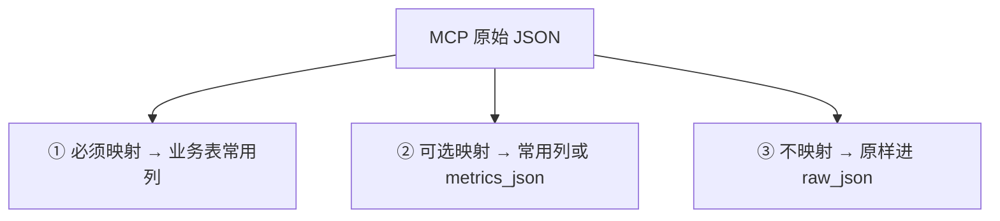
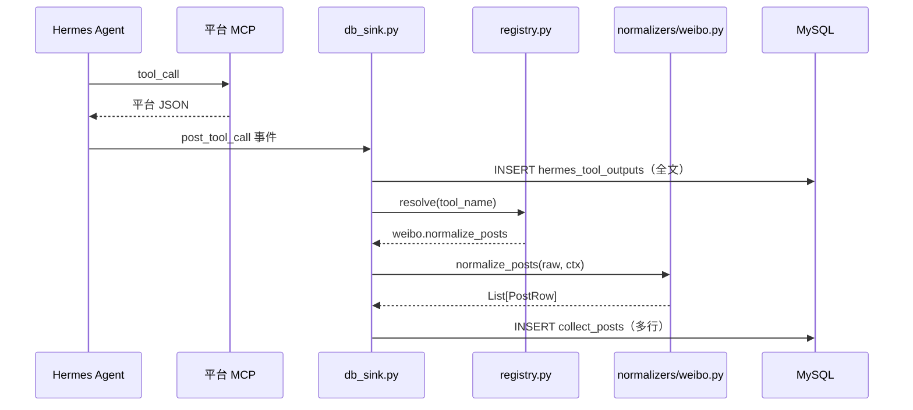

# Normalizers 架构设计

> 状态：**讨论稿**（2026-07-06）  
> 配套：[MySQL数据库设计.md](MySQL数据库设计.md) · [01-账号信息采集](workflows/01-账号信息采集.md)

---

## 一、定位

**Normalizer** 是把各社交平台 MCP 返回的**异构 JSON**，转换为业务表「**统一常用列 + 行级 raw_json**」的**确定性 Python 模块**。

| 谁做 | 做什么 |
|------|--------|
| **Hermes Agent（模型）** | 按 Skill 调 MCP、走 Clarify；**不**拼 INSERT、**不**做字段映射 |
| **Hook `db_sink.py`** | 收 `post_tool_call` 事件，写 `hermes_tool_outputs`，调度 Normalizer |
| **Normalizer** | 按 `platform` + `tool_name` 映射常用列，批量写 `collect_*` 等 |
| **Java** | 只读业务表常用列；需要平台细节时读 `raw_json` |

---

## 二、要不要每个字段都映射？

**不要。** 只映射三类：



| 类别 | 处理方式 | 示例 |
|------|----------|------|
| **① 必须** | Normalizer 必填，否则该行不入库 | `account_id`, `content_id`, `content_type`, `raw_json` |
| **② 可选** | 有则填，无则 NULL | `view_count`, `verified`, `repost_count` |
| **③ 不映射** | 整段保留在 `raw_json` | 微博阳光信用、B站等级、各平台冷门字段 |

新平台接入：**加一个 normalizer 文件 + 注册路由**，通常**不用改 MySQL 表结构**。

---

## 三、入库管线



### 3.1 上下文 `ctx`（Hook 组装）

```python
{
    "task_id": "uuid-...",
    "question_id": "uuid-...",
    "tool_output_id": 12345,      # 刚插入 hermes_tool_outputs 的 id
    "tool_name": "mcp_weibo_get_feeds",
    "mcp_server": "weibo",
    "platform": "weibo",          # 可由 tool_name 或 mcp_server 推导
    "account_id": "...",          # 从 tool_args 或 session 上下文
    "collect_options": { ... },   # 从 hermes_task_steps 汇总
}
```

### 3.2 固定三步（不可跳过）

1. **原文必落** `hermes_tool_outputs`  
2. **Normalizer 解析**（失败不抛死整个 Hook，记日志）  
3. **业务表写入**（profile 通常 1 行，feeds 可能 N 行）

---

## 四、目录结构（规划）

```
scripts/
├── db_sink.py                 # Hermes Hook 入口
├── db.py                      # MySQL 连接与 insert 封装
├── normalizers/
│   ├── __init__.py
│   ├── base.py                # safe_int, parse_datetime, media 数组规范化
│   ├── registry.py            # tool_name → 处理函数
│   ├── types.py               # ProfileRow / PostRow 数据类或 TypedDict
│   ├── weibo.py
│   ├── bilibili.py
│   ├── twitter.py
│   ├── maigret.py             # 02 跨平台候选（后期）
│   └── generic.py             # 未识别 tool：仅日志，不写业务表
└── tests/
    └── fixtures/              # 各平台 MCP 样例 JSON
        ├── weibo_profile.json
        └── weibo_feeds.json
```

---

## 五、核心模块说明

### 5.1 `registry.py` — 路由表

```python
# 伪代码示意
TOOL_HANDLERS = {
    "mcp_weibo_get_profile": ("weibo", "normalize_profile"),
    "mcp_weibo_get_feeds": ("weibo", "normalize_posts"),
    "mcp_weibo_search_content": ("weibo", "normalize_posts"),
    "mcp_bilibili_get_user_info": ("bilibili", "normalize_profile"),
    "mcp_bilibili_search_videos": ("bilibili", "normalize_posts"),
    # ...
}
```

| 规则 | 说明 |
|------|------|
| 一个 `tool_name` 对应一个处理函数 | 避免一个函数里大量 if |
| 未注册 | 只保留 `hermes_tool_outputs`，`logger.warning` |
| 后期可加前缀匹配 | `mcp_weibo_*` → weibo 模块（慎用，优先显式注册） |

### 5.2 `base.py` — 公共工具

| 函数 | 作用 |
|------|------|
| `safe_int(v)` | 转整数，失败返回 None |
| `safe_bool(v)` | 转布尔 |
| `parse_datetime(v, platform)` | 各平台时间格式统一为 UTC 或 +08:00 |
| `normalize_media(items)` | 输出 `[{type, url, thumb}]` |
| `build_profile_row(...)` | 组装符合 `collect_profiles` 的 dict |
| `build_post_row(...)` | 组装符合 `collect_posts` 的 dict |

### 5.3 平台模块约定

每个 `normalizers/{platform}.py` 建议只暴露：

```python
def normalize_profile(raw: dict, ctx: dict) -> dict | None:
    """返回一行 collect_profiles 数据，无法解析返回 None"""

def normalize_posts(raw: dict, ctx: dict) -> list[dict]:
    """返回 0~N 行 collect_posts 数据"""
```

**一个 MCP 响应里有多条内容**（如 feeds 列表）→ 在 `normalize_posts` 内循环，每元素一行 + 各自 `raw_json`。

### 5.4 `types.py` — 行结构契约

与 [MySQL数据库设计.md §5.4](MySQL数据库设计.md#54-01-统一常用字段契约normalizer-输出) 对齐，Hook 写入前做轻量校验：

- `platform`, `account_id`, `raw_json` 非空  
- `content_id` 非空才插入 `collect_posts`  
- 互动指标允许全 NULL  

---

## 六、映射示例（微博 · 示意）

> 真实字段名以 MCP 实际返回为准，上线前用 fixture 单测锁定。

### 6.1 Profile

| 统一列 | 微博 MCP 可能字段 |
|--------|-------------------|
| `account_id` | `id` / `uid` |
| `display_name` | `screen_name` |
| `bio` | `description` |
| `avatar_url` | `avatar_hd` / `profile_image_url` |
| `follower_count` | `followers_count` |
| `following_count` | `friends_count` |
| `content_count` | `statuses_count` |
| `verified` | `verified` |
| `raw_json` | **整条 profile 对象** |

### 6.2 Post

| 统一列 | 微博 MCP 可能字段 |
|--------|-------------------|
| `content_id` | `id` / `mid` |
| `content_type` | 有 `retweeted_status` → `repost`，否则 `post` |
| `content_text` | `text` |
| `published_at` | `created_at` |
| `like_count` | `attitudes_count` |
| `comment_count` | `comments_count` |
| `repost_count` | `reposts_count` |
| `view_count` | 常无 → NULL |
| `parent_content_id` | `retweeted_status.id` |
| `media_json` | 从 `pic_urls` / `page_info` 构造 |
| `raw_json` | **单条 status 对象** |

---

## 七、与 `hermes_tool_outputs` 的关系

| 对比 | `hermes_tool_outputs` | 业务表 `raw_json` |
|------|----------------------|-------------------|
| 粒度 | 一次 tool 调用一整包 | 一行业务记录一条 |
| 内容 | MCP 完整响应 | 从响应中拆出的单条对象 |
| 用途 | 重跑 Normalizer、审计 | 行级对账、Java 详情页 |
| 关系 | 1 个 tool_output_id | 多行可共用同一 `tool_output_id` |

**重解析流程**（映射逻辑修 bug 后）：

```text
SELECT * FROM hermes_tool_outputs WHERE task_id = ?
→ 对每条重新 normalize
→ DELETE collect_* WHERE tool_output_id = ? （或 upsert）
→ 重新 INSERT
```

不必重新调用 MCP。

---

## 八、错误处理策略

| 场景 | 行为 |
|------|------|
| JSON 解析失败 | 只保留 `hermes_tool_outputs`，`status=error` |
| 缺 `content_id` | 跳过该行，记 `warn`，不影响同包其他行 |
| 缺可选指标 | 对应列 NULL |
| 未注册 `tool_name` | 跳过业务表，`warn` |
| DB 写入失败 | 记错误日志；`hermes_tool_outputs` 已落则不丢 |

**原则**：Hook **不因单条内容失败而中断** Agent 对话。

---

## 九、测试策略

### 9.1 Fixture 单测（必做）

```
tests/fixtures/weibo_profile.json  → assert normalize_profile(...)["account_id"]
tests/fixtures/weibo_feeds.json    → assert len(normalize_posts(...)) == N
```

每新增平台 / 修改 MCP：**先更新 fixture，再改 normalizer**。

### 9.2 集成测试（可选）

`hermes chat` 走一小段采集 → 查 DB 行数与常用列非空率。

---

## 十、分阶段落地

| 阶段 | 范围 |
|------|------|
| **P0** | `db_sink.py` 只写 `hermes_tool_outputs` + `hermes_tasks` |
| **P1** | `weibo.normalize_profile` + `weibo.normalize_posts` |
| **P2** | `bilibili` 同上 |
| **P3** | `twitter`、`maigret`（02 候选） |
| **P4** | 03/04 专用 normalizer（verify_evidence、multimodal_findings） |

未覆盖平台：**允许只落原文**，业务表为空，不阻塞流程。

---

## 十一、与五类业务扩展

| 业务 | Normalizer 目标表 | 说明 |
|------|-------------------|------|
| 01 采集 | `collect_profiles`, `collect_posts` | 本文重点 |
| 02 跨平台 | `cross_platform_candidates` | `maigret.py`、各平台 search |
| 03 核查 | `verify_account_results`, `verify_evidence` | 可规则脚本 + 少量 normalizer |
| 04 多模态 | `multimodal_findings` | OCR / vision 结果 |
| 05 报告 | `verify_report_contents` | 一般由 `post_llm_call` 写，非 MCP normalizer |

**同一套 registry 模式**，按 `tool_name` 扩展即可。

---

## 十二、明确不做的事

| 不做 | 原因 |
|------|------|
| 让 LLM 读 JSON 再填表 | 不稳定、难审计 |
| 每个平台字段都建 MySQL 列 | 表爆炸 |
| 在 Normalizer 里调 MCP | 只做解析，不调外部 |
| 跨平台比较 raw 指标 | 由上层报告逻辑处理 |

---

## 十三、待确认项

| # | 项 | 说明 |
|---|-----|------|
| 1 | Python 路径 | Hook 用 `D:/environment/python/python.exe` 还是 venv |
| 2 | `task_id` 来源 | `X-Hermes-Session-Key: task:{id}` 或 Java 首条消息注入 |
| 3 | Upsert vs Insert | 同 task 重复采集是否覆盖（当前倾向 insert 新快照） |
| 4 | `stats_json` 去留 | 与独立 `like_count` 等列合并后是否废弃 `stats_json` |
| 5 | 评论 normalizer | 与 post 共用 `normalize_posts` 还是独立函数 |

---

## 十四、相关文件

| 文件 | 状态 |
|------|------|
| [MySQL数据库设计.md](MySQL数据库设计.md) | 表结构讨论稿 |
| `scripts/db_sink.py` | 待实现 |
| `scripts/normalizers/` | 待创建 |
| `scripts/sql/002_init_business.sql` | 已有初版，待 `003` 对齐 01 字段 |

---

*文档版本：2026-07-06 · 讨论稿*
