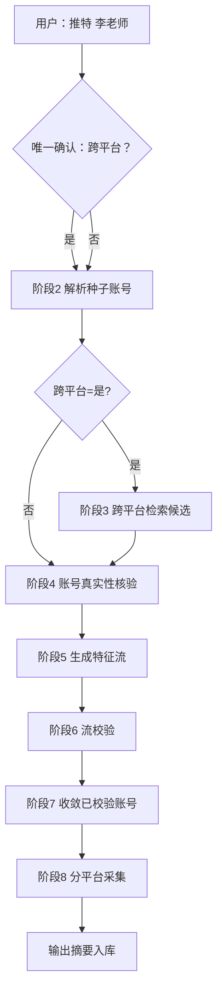

# 01 · 账号信息采集

> **交互模式（密塔式）**：用户**仅在第一步**点选一次（是否跨平台采集），之后全流程**自动执行**，过程中不再弹出确认。  
> **定位**：一体化智能采集入口 —— 从种子账号出发，自动完成跨平台发现、真实性核验、特征流生成与校验、分平台深度采集。  
> **Skill（已创建）**：`skills/account-intelligence/account-intelligence-collect/SKILL.md`  
> 调用：`/account-intelligence-collect 采集推特平台的李老师，需要跨平台采集`

---

## 一、业务目标

用户给出 **平台 + 账号标识**（如「推特平台的李老师」），系统在用户完成**唯一一次选择**后，自动跑通：

| 阶段 | 做什么 | 用户是否参与 |
|------|--------|--------------|
| 种子解析 | 识别目标账号（平台、ID、主页） | 否 |
| 跨平台发现 | 在其他平台检索同一自然人账号 | 否（由首步选择决定做不做） |
| 真实性核验 | 判断候选账号是否真实存在、是否像同一人 | 否 |
| 特征流生成 | 从主页、简介、头像等生成**文本流 / 图片流** | 否 |
| 流校验 | 对各流做一致性与可信度校验 | 否 |
| 账号收敛 | 汇总「校验通过」的账号清单 | 否 |
| 分平台采集 | 对各平台已确认账号拉取资料与内容 | 否 |

| 最终产出 | 说明 |
|----------|------|
| 人物信息 | hermes chat 对话中 **【人物信息】** 段落展示 |
| 发文信息 | hermes chat 对话中 **【发文信息】** 列表展示 |
| 中间核验/流 | 内部执行，不向用户展开术语 |
| 持久化 | v1 不入库；后续 Hook 写入 MySQL |

---

## 二、与旧版（5 类）的关系

| 旧流程 | 新位置 |
|--------|--------|
| 02 跨平台账号收集 | 并入本文 **阶段 3**（自动） |
| 03 账号核查 | 并入本文 **阶段 4～6**（自动核验 + 流校验） |
| 01 末尾多轮确认点 | **取消**；仅保留首步「是否跨平台」 |
| 04 多模态分析 | 仍为独立 **03 类业务**（对本流程产出的疑点做深度分析） |
| 05 核查报告 | 仍为独立 **04 类业务** |

---

## 三、触发条件

**用户指令示例**：

> 推特平台的李老师  
> 采集 Twitter 上的 @teacher_li  
> 查一下李老师这个账号

**系统解析最小输入**：

- `platform`：如 `twitter`
- `account_hint`：昵称 / @handle / 主页链接 / 用户口语称呼（如「李老师」）

解析失败时，在**首步确认之前**可有一次**文本澄清**（不算选项点击，属输入补全）；补全后仍进入唯一选项确认。

---

## 四、交互模型：仅首步一次点选

### 4.1 密塔式原则

```
用户下发任务
    │
    ▼
【唯一确认点】是否跨平台采集？  ← 用户点选（仅此一次）
    │
    ▼
阶段 2～8 全自动（前端可展示进度条/日志，但不再 clarify）
    │
    ▼
输出采集结果摘要
```

| 对比 | 旧版 01 | 新版 01 |
|------|---------|---------|
| 过程中 clarify | 关键词、时间、数量、下一步… | **无** |
| 用户点选次数 | 多次 | **1 次**（跨平台是/否） |
| 跨平台 / 核查 | 用户逐步跳转 02、03 | **同一 Skill 内自动串联** |
| 进度反馈 | 每步等待用户 | UI **只读**展示阶段状态 |

### 4.2 唯一确认点（前端完成，不落库 step 表）

是否跨平台由**前端点选**，与用户输入**合成一句话**交给 Java，例如：

```text
采集推特平台的李老师，需要跨平台采集
```

Java 写入：

| 位置 | 内容 |
|------|------|
| `hermes_tasks.cross_platform` | `1` 或 `0` |
| `hermes_user_dialogues` | 用户完整一句话 |
| 调 Hermes | 同一句 `input` 转发 |

**不使用** `hermes_task_steps`；Skill 内 **禁止** `clarify`。

---

## 五、自动流程（阶段 2～8）



### 阶段 2 · 种子账号解析

| 项 | 说明 |
|----|------|
| 输入 | 用户指令 + `platform` |
| 动作 | 调用对应平台 MCP（如 `mcp_twitter_*`）解析 handle → `account_id`、主页 URL |
| 产出 | 种子账号写入 `hermes_tasks.subject_json.seed` |
| 失败 | 任务 `failed`，**不进入**确认点（账号不存在则直接提示） |

### 阶段 3 · 跨平台收集（仅当用户选「是」）

| 项 | 说明 |
|----|------|
| 输入 | 种子账号资料（昵称、头像 URL、简介、外链） |
| 动作 | Maigret `collect_accounts`；**全量命中**进入候选，**无平台优先级** |
| 产出 | `cross_platform_candidates` 候选列表 + 置信度 |
| 说明 | 原 02 流程的检索部分；**裁决**交给阶段 4～6；禁止只查部分平台或把 Maigret 表当最终输出 |
| 禁止 | `web_search` / 浏览器代替已接入 MCP 拉各平台 profile |

### 阶段 4 · 账号真实性核验

| 项 | 说明 |
|----|------|
| 范围 | 种子账号 + 阶段 3 候选（若未跨平台则仅种子） |
| 动作 | 拉取各账号公开资料；规则 + 模型判断：账号是否存在、是否疑似同人、是否疑似冒充 |
| 产出 | 初步 `verify_account_results`（或本流程专用中间表）；过滤明显无效号 |
| 原则 | 无法判定时标记 `insufficient_data`，**不强行**并入后续流 |

### 阶段 5 · 特征流生成

根据阶段 4 保留账号的**主页与公开资料**，由模型整理为可校验的「流」：

| 流类型 | 来源示例 | 用途 |
|--------|----------|------|
| **文本流** | 账号名、@handle、简介、所在地、外链文字、简介中的手机号/邮箱片段 | 跨平台文本一致比对 |
| **图片流** | 头像、主页横幅、资料页中的展示图 | 视觉同人比对（OCR/相似度） |

**规则**：

- 有图片则生成图片流条目（含 `image_url`、`source_account`）  
- 有简介/名称则生成文本流条目（含 `text`、`source_field`）  
- 一条账号可贡献多段流；流带 `stream_id` 供阶段 6 引用  

产出写入规划表 `collect_identity_streams`（或 `extra_json` 暂存，表结构后续在 MySQL 文档微调）。

### 阶段 6 · 流校验

对各 `stream_id` 做自动校验（**无用户点击**）：

| 校验项 | 说明 |
|--------|------|
| 文本一致 | 多平台昵称/简介是否指向同一人 |
| 图片一致 | 头像是否同源或高度相似 |
| 冲突检测 | 简介职业/地区明显矛盾 → 降权或剔除 |
| 质量 | 图片不可达、文本过短 → 标记 `low_quality` |

产出：`stream_validation` 结果；通过校验的账号进入阶段 7。

### 阶段 7 · 收敛已校验账号

| 项 | 说明 |
|----|------|
| 输入 | 阶段 4 账号集 ∩ 阶段 6 流校验通过集 |
| 产出 | **`validated_accounts` 清单**（平台 + account_id + 置信度 + 依据流 ID） |
| 展示 | 前端只读表格；用户**不可**在此步改选（若要改须**新任务**） |

### 阶段 8 · 分平台采集

对 `validated_accounts` 中每个账号：

1. 按平台调用 MCP：`get_profile` → `collect_profiles`  
2. 按**默认采集策略**拉内容 → `collect_posts`（见 §八）  
3. 全程 `hermes_tasks.status = running`，Hook + Normalizer 入库（v1 对话模式可暂不入库）

**完成门禁**：种子平台发文必须采到；最终输出必须含【人物信息】+【发文信息】。不得以 Maigret 扫描表或人物背景介绍代替本阶段。

完成后：`status = completed`，推送摘要。

---

## 六、示例对话（新交互）

```
【前端】用户输入：推特平台的李老师
【前端】点选：需要跨平台采集
【前端 → Java】一句话：「采集推特平台的李老师，需要跨平台采集」

Java：写入 hermes_tasks、hermes_user_dialogues，调 Hermes

系统：（自动，前端只读进度）
      ✓ 种子账号已解析
      ✓ 跨平台检索 …
      ✓ 流校验 …
      ✓ 分平台采集完成
      【结果摘要】见任务中心

全程：前端 1 次点选 + 1 句话，无过程中 clarify。
```

---

## 七、数据输出结构（草案）

```json
{
  "task_type": "account_collect",
  "cross_platform": true,
  "seed": {
    "platform": "twitter",
    "account_id": "123",
    "account_handle": "@teacher_li",
    "display_name": "李老师"
  },
  "validated_accounts": [
    {
      "platform": "twitter",
      "account_id": "123",
      "confidence": 0.95,
      "stream_ids": ["txt_001", "img_001"]
    },
    {
      "platform": "bilibili",
      "account_id": "uid_xxx",
      "confidence": 0.88,
      "stream_ids": ["txt_002", "img_001"]
    }
  ],
  "streams": {
    "text": [
      { "stream_id": "txt_001", "text": "李老师 | 教育博主", "source": "twitter.bio", "validation": "pass" }
    ],
    "image": [
      { "stream_id": "img_001", "url": "https://...", "source": "twitter.avatar", "validation": "pass" }
    ]
  },
  "collect_summary": {
    "profiles": 2,
    "posts": 68
  }
}
```

人物表 / 发文表字段约定见 [MySQL数据库设计.md](../MySQL数据库设计.md)；入库管线见 [normalizers架构设计.md](../normalizers架构设计.md)。

---

## 八、默认采集策略（无过程中确认）

过程中不再询问关键词、时间、数量；由 **Skill 默认 + `config.yaml` 可配置**：

| 参数 | 默认值（建议） | 配置位置 |
|------|----------------|----------|
| 内容时间范围 | 最近 90 天 | Skill / 平台配置 |
| 主内容条数上限 | 50 条/账号 | 同上 |
| 是否含转发 | 否 | 同上 |
| 评论 | 默认不采（降耗） | 同上 |

运维或 Java **任务创建时**可传覆盖参数（不进 clarify，写入 `subject_json.collect_defaults`）。

---

## 九、与 Hermes 的映射

| 能力 | 组件 |
|------|------|
| 唯一确认点 | 首步 `clarify` 或 Java `[系统确认]` |
| 后续全自动 | Skill 内阶段状态机；**禁止**阶段 2～8 使用 `clarify` |
| 跨平台检索 | maigret、各平台 search MCP |
| 核验与流 | 模型 + 规则脚本；OCR/vision MCP（图片流） |
| 分平台采集 | 各平台 profile/feeds MCP + Normalizer |
| 持久化 | v1 **仅对话输出**；后续 Hook `db_sink.py` 入库 |
| 进度展示 | Java 轮询 `hermes_tasks.status` + 阶段字段（待扩展 `phase`） |

**`hermes_tasks.status` 建议扩展**：

| status | 含义 |
|--------|------|
| `waiting_user` | 仅等待首步「跨平台」点选 |
| `running` | 阶段 2～8 执行中 |
| `completed` / `failed` | 终态 |

可选字段 `current_phase`：`resolve_seed` / `cross_platform` / `verify` / `stream_gen` / `stream_validate` / `collect`  

---

## 十、异常与边界

| 情况 | 处理 |
|------|------|
| 种子账号不存在 | 首步确认前失败，提示用户 |
| 跨平台无候选 | 继续单种子流校验与采集，摘要注明「未发现其他平台」 |
| 流校验全部失败 | `failed` 或 `completed` 但 `validated_accounts` 为空，摘要说明原因 |
| 某平台采集限流 | 该平台 partial，其他平台继续；摘要分项标注 |
| 用户想改「跨平台」选择 | **新建任务**，本任务不回退 |

---

## 十一、相关文档

| 文档 | 说明 |
|------|------|
| [MySQL-01账号采集表设计.md](../MySQL-01账号采集表设计.md) | **01 开工用 10 张表**（Java 首步） |
| [平台总览与框架设计.md](../平台总览与框架设计.md) | 4 类业务总览 |
| [02-跨平台账号收集.md](02-跨平台账号收集.md) | **已并入本文阶段 3**（存档） |
| [03-账号核查.md](03-账号核查.md) | **已并入本文阶段 4～6**（存档） |
| [04-账号多模态分析.md](04-账号多模态分析.md) | 独立第 3 类：对本流程产出的疑点做深度分析 |
| [05-账号核查报告.md](05-账号核查报告.md) | 独立第 4 类：成稿报告 |

---

*文档版本：2026-07-06 · 4 类业务改版*
