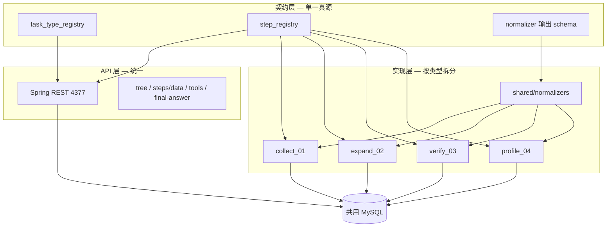

# 四业务统一入库与深度模式架构

> 版本：2026-07-09  
> 状态：**已定方向，待分阶段落地**  
> 相关：[账号采集-前端深度模式开发指南.md](账号采集-前端深度模式开发指南.md) · [账号采集-前端接口文档.md](账号采集-前端接口文档.md) · [MySQL-01账号采集表设计.md](MySQL-01账号采集表设计.md) · [入库与编排说明.md](入库与编排说明.md)

---

## 一、背景与目标

当前 **01 账号采集** 的深度模式（Java 预建任务 + Hook 入库 + 前端轮询 tree）已基本跑通。接下来要接入另外三类业务：

| 编号 | 业务名称 | 简要说明 |
|------|----------|----------|
| **01** | 账号采集 | 现有实现；种子 → 跨平台 → 主页/发文 → 流对比 → 可信账号 → 报告 |
| **02** | 账号扩建 | 四段式：账号扩建收集 → 多平台信息采集 → 账号核查 → 可信账号输出；流程与 01 高度相似 |
| **03** | 账号核查 | 用户给定多平台账号，判断是否为同一人 |
| **04** | 画像写报 | 与 01/02 步骤相似，但步骤更多、输出规则更多（类似最初版 Hermes 写报） |

**核心诉求：** 四类业务入库流程、调用工具可能不同，但尽可能保证 **数据库字段一致**，前端 **全部走深度模式树**，查询 API 形态统一。

---

## 二、已确认的需求（需求纪要）

以下结论来自 2026-07-09 需求对齐，作为后续开发的约束。

### 2.1 数据库组织

| 决策 | 选择 |
|------|------|
| 表是否共用 | **A：尽量共用同一套表**，用 `hermes_tasks.task_type` 区分业务 |
| 业务结果表 | 四类任务 **都要写** `collect_profiles`、`cross_platform_candidates`、`collect_identity_streams`、`collect_validated_accounts`、`collect_posts` 等现有业务表 |

### 2.2 前端与 API

| 决策 | 选择 |
|------|------|
| 交互形态 | 四类 **全部是深度模式树** |
| 接口形态 | 统一：`/start` → 轮询 `tree` → 点步骤 `steps/{stepKey}/data` → `tools` → `final-answer` |
| 任务类型识别 | **前端显式传 `taskType`** + Java 映射为 skill 名（如 `account-intelligence-collect`）再发 Gateway |
| Java 组织方式 | **一套通用 REST**，靠 `task_type` / 注册表分发预建与提交逻辑，查询类接口尽量通用 |

### 2.3 步骤键（step_key）

| 决策 | 选择 |
|------|------|
| 命名策略 | **B：能共用的步骤尽量同名**（如都有跨平台扫描就叫 `step2_cross_platform`），仅差异步骤单独命名 |
| 步骤数据 API | 同一 `step_key` 在不同 `task_type` 下，**返回字段名必须相同**（记录条数可不同） |
| 04 画像写报 | 与 01/02 **步骤结构相似**，但会 **多出一些步骤** 和 **更多输出规则** |

### 2.4 入库代码（Python Hook）

| 决策 | 选择 |
|------|------|
| 流程拆分 | **每类业务单独拆分入库流程**（独立 `phases.py` / `task_store.py` / `sink.py`） |
| task_store | **不共用** 完整 `task_store`（各业务状态机、门禁不同） |
| normalizer | **可共用**（只负责 MCP 工具返回 → 标准 profiles/posts/candidates 结构） |
| Hook 入口 | `scripts/db_sink.py` 统一入口，按 `task_type` 分发到各业务 `sink` |

### 2.5 落库分工（延续 01 约定）

```
前端 → Spring REST（4377）→ Java 预建 hermes_tasks + collect_phase_steps
                        → 异步调 Hermes Gateway
Hermes Hook → 步骤推进、hermes_tool_outputs、业务表、终稿 summary
```

- `session_id`：同页多轮对话复用  
- `task_id`：每次任务新建  
- 同 session 同时只允许一个 `pending/running` 任务  
- `hermes_tool_outputs.phase` = `collect_phase_steps.step_key`（非大阶段名）

---

## 三、业务与 task_type 映射

| 前端 `taskType` | `hermes_tasks.task_type` | 映射 skill（发 Gateway） | 说明 |
|-----------------|--------------------------|--------------------------|------|
| `collect` | `account_collect` | `account-intelligence-collect` | 01，已实现 |
| `expand` | `account_expand` | `account-intelligence-expand` | 02，账号扩建 |
| `verify` | `account_verify` | `account-intelligence-verify` | 03，账号核查 |
| `profile` | `account_profile` | `account-intelligence-profile` | 04，画像写报 |

**前端请求示例：**

```http
POST /api/collect/start
Content-Type: application/json

{
  "taskType": "expand",
  "sessionId": "api_...",
  "message": "账号扩建：推特 @whyyoutouzhele，需跨平台"
}
```

Java 内部将 `taskType` 转为 skill 前缀写入发往模型的 message，并写入 `hermes_tasks.task_type`。

---

## 四、架构总览

### 4.1 三层一致性模型

保证字段一致，不靠「大家约定一下」，而靠 **契约层 + 通用查询 + 分业务入库**：



| 层级 | 保证什么一致 | 载体 |
|------|-------------|------|
| **存储契约** | 表字段、含义、扩展规则 | `scripts/sql/003_init_collect_01.sql` + 后续统一 migration |
| **步骤契约** | `step_key` ↔ 业务表 ↔ API `dataType` | `step_registry`（待建） |
| **入库契约** | MCP 原始 JSON → 业务行字段 | `shared/normalizers` |

### 4.2 共用表清单（不变）

| 表 | 用途 |
|----|------|
| `hermes_tasks` | 任务主表，`task_type` 区分业务 |
| `collect_phase_steps` | 每任务步骤树（行数、标题可按业务不同） |
| `hermes_tool_outputs` | 工具调用审计，`phase` = `step_key` |
| `hermes_user_dialogues` | 用户输入、助手回复、summary 终稿 |
| `collect_profiles` | 人物资料 |
| `cross_platform_candidates` | 跨平台候选 |
| `collect_identity_streams` | 文本流 / 图片流 |
| `collect_validated_accounts` | 可信账号 |
| `collect_posts` | 发文 |

**不采用**「每业务一套独立业务表」方案（如 `verify_subjects`、`verify_reports` 等分表），与早期讨论稿 `MySQL数据库设计.md` v2 中 L3 分表设想 **以本文为准**。

---

## 五、步骤键（step_key）设计

### 5.1 公共步骤池（01/02/03/04 尽量共用）

| step_key | 含义 | steps/data 对应表 |
|----------|------|-------------------|
| `step1_seed` | 种子账号资料采集 | `collect_profiles` |
| `step2_cross_platform` | 跨平台账号收集（Maigret） | `cross_platform_candidates` |
| `step3_profiles` | 各平台主页采集 | `collect_profiles` |
| `step3_streams` | 文本流与图片流拆分 | `collect_identity_streams` |
| `step4_text_compare` | 文本流对比 | `collect_identity_streams`（`stream_type=text`） |
| `step4_image_compare` | 图片流对比 | `collect_identity_streams`（`stream_type=image`） |
| `step5_validated` | 可信账号收敛 | `collect_validated_accounts` |
| `step6_posts` | 分平台发文采集（汇总） | `collect_posts` |
| `step6_post_{platform}` | 单平台发文 | `collect_posts` |

### 5.2 业务差异步骤（仅部分 task_type 使用）

| step_key | 适用业务 | 说明 |
|----------|----------|------|
| `step1_input_accounts` | 03 账号核查 | 用户给定多平台账号列表（不入 MCP 采种子） |
| `step7_report_outline` | 04 画像写报 | 报告提纲 / 结构规划 |
| `step7_evidence_bind` | 04 画像写报 | 证据与章节绑定 |
| `step8_report_finalize` | 04 画像写报 | 终稿规则校验与输出 |

> 新增步骤 **只增 step_key，不改旧 step_key 语义**。04 可在 01 步骤之后追加 `step7_*`、`step8_*`。

### 5.3 各业务步骤树（草案）

**01 账号采集** — 现有实现，跨平台关闭时 step2～step5 标记 `skipped`。

**02 账号扩建** — UI 四段，底层映射公共 step_key：

| UI 段落 | 底层 step_key |
|---------|---------------|
| 一、账号扩建收集 | `step1_seed` |
| 二、多平台信息采集 | `step2_cross_platform` + `step3_profiles` + `step6_posts` |
| 三、账号核查 | `step3_streams` + `step4_text_compare` + `step4_image_compare` |
| 四、可信账号输出 | `step5_validated` |

**03 账号核查** — 跳过 MCP 采种子，从用户输入开始：

```
step1_input_accounts → step3_profiles → step3_streams → step4_* → step5_validated
（step1_seed / step2_cross_platform 可 skipped 或不存在）
```

**04 画像写报** — 在 01/02 流水线基础上追加写报步骤：

```
step1_seed → … → step5_validated → step6_* → step7_report_outline → step7_evidence_bind → step8_report_finalize
```

---

## 六、字段一致性规则（铁律）

1. **业务表禁止按 task_type 加不同列**  
   差异放 `seed_json`、`subject_json`、`raw_json`、`evidence_json` 等 JSON 列。

2. **写入业务表必须走 normalizer 标准输出**  
   禁止各 `sink` 自行拼装不同字段名的 dict。

3. **同一 step_key 永远映射同一张表、同一套 SELECT 字段**  
   `TaskStepDataQueryService` 保持通用，不按 `task_type` 分叉。

4. **hermes_tool_outputs.phase 存 step_key**  
   使用 `tool_step_key(tool_name)`；`mcp_server` 为空时 API 层返回 `vision`。

5. **扩展字段走统一 migration**  
   任何业务需要新列，必须四业务评审后改表，避免某业务私自 ALTER。

6. **step_registry 为单一真源**  
   定义 `step_key → dataType → 表名 → 字段列表`；Java `TaskStepDataQueryService` 与文档从此读取。

---

## 七、代码目录规划（预计修改）

### 7.1 Python（scripts/）

**现状：**

```
scripts/
  db_sink.py              # 入口，当前仅转发 collect_01
  collect_01/
    phases.py
    task_store.py
    sink.py
    normalizers/          # 工具解析
```

**目标：**

```
scripts/
  db_sink.py                    # 按 task_type 分发到各业务 sink
  shared/
    normalizers/                # 从 collect_01/normalizers 上提
    step_registry.py            # step_key 契约（可与 YAML 二选一）
    task_type_registry.yaml     # taskType → task_type → skill
  collect_01/                   # 01 不变结构，normalizer 改 import
    phases.py
    task_store.py
    sink.py
  expand_02/                    # 新建
    phases.py
    task_store.py
    sink.py
  verify_03/                    # 新建
    phases.py
    task_store.py
    sink.py
  profile_04/                   # 新建
    phases.py
    task_store.py
    sink.py
```

**`db_sink.py` 分发伪代码：**

```python
task = resolve_active_task(session_id)  # 查 hermes_tasks.task_type
handlers = {
    "account_collect": collect_01.sink,
    "account_expand": expand_02.sink,
    "account_verify": verify_03.sink,
    "account_profile": profile_04.sink,
}
handlers[task["task_type"]].handle_event(payload)
```

**task_store 拆分原则：**

- 各业务 **独立** `task_store.py`（建任务、步骤状态机、finalize、门禁）
- 可选抽 **极薄** `shared/db_ops.py`：仅 `save_tool_output`、`get_task` 等无业务语义的原语
- **不** 把 01 的 `finalize_task`、跨平台门禁等强行共用

### 7.2 Java（clients/hermes-xa/）

**现状：**

```
collect/
  controller/CollectApiController.java
  service/
    CollectSubmitService.java
    CollectTaskCreateService.java   # 仅 01
    TaskTreeQueryService.java       # 通用
    TaskStepDataQueryService.java   # 通用
    TaskStepToolsQueryService.java  # 通用
    TaskFinalAnswerQueryService.java
  mapper/CollectTaskMapper.java
```

**目标：**

```
collect/
  controller/CollectApiController.java     # 增加 taskType 参数处理
  registry/
    TaskTypeRegistry.java                  # 新建：taskType → task_type, skill, 预建策略
    StepRegistry.java                      # 新建：step_key → dataType（可选，或先保留 Service 内映射）
  service/
    CollectSubmitService.java              # 改：读 registry，分发预建与 Gateway message
    create/
      CollectTaskCreateService.java        # 01 预建（从现类迁入或实现接口）
      ExpandTaskCreateService.java         # 02
      VerifyTaskCreateService.java         # 03
      ProfileTaskCreateService.java        # 04
    TaskTreeQueryService.java              # 保持通用
    TaskStepDataQueryService.java          # 保持通用，后续可读 StepRegistry
    TaskStepToolsQueryService.java
    TaskFinalAnswerQueryService.java
  mapper/CollectTaskMapper.java            # 保持通用，insertTask 增加 task_type 参数
```

**查询类 Service 不改签名**：`GET /api/tasks/{taskId}/tree` 等只认 `task_id`，不感知 `task_type`。

### 7.3 配置文件

| 文件 | 内容 |
|------|------|
| `scripts/shared/task_type_registry.yaml` | 四类 taskType、skill、默认步骤树模板 |
| `scripts/shared/step_registry.yaml` | step_key、dataType、表、字段列表 |
| `config.yaml` | Hook 仍指向 `scripts/db_sink.py` |

### 7.4 Skills（Hermes）

每类业务需对应 skill（部分待建）：

| skill | 状态 |
|-------|------|
| `account-intelligence-collect` | 已有 |
| `account-intelligence-expand` | 待建 |
| `account-intelligence-verify` | 待建 |
| `account-intelligence-profile` | 已有 `account-intelligence-profile/SKILL.md`，需与写报流程对齐 |

---

## 八、统一 API 契约（前端不变）

| 接口 | 说明 |
|------|------|
| `POST /api/collect/start` | 新增 body 字段 `taskType`；Java 映射 skill |
| `GET /api/tasks/{taskId}/tree` | 通用，读 `collect_phase_steps` + 工具桶 |
| `GET /api/tasks/{taskId}/steps/{stepKey}/data` | 通用，同 step_key 字段名一致 |
| `GET /api/tasks/{taskId}/steps/{stepKey}/tools` | 通用，`status=success`，`mcp_server` 空→`vision` |
| `GET /api/tasks/{taskId}/final-answer` | 通用，优先 `summary` |
| `GET /api/tasks/{taskId}/nodes/{nodeId}` | 通用 |

**`steps/{stepKey}/data` 响应骨架（四类一致）：**

```json
{
  "taskId": "...",
  "stepKey": "step3_profiles",
  "title": "...",
  "status": "completed",
  "statusLabel": "结论明确",
  "message": null,
  "dataType": "collect_profiles",
  "recordCount": 3,
  "records": [ { "platform": "...", "accountHandle": "...", ... } ]
}
```

---

## 九、各业务 seed_json / subject_json 扩展（差异吸收点）

业务差异 **不进业务表列**，进任务 JSON：

```json
// 01 / 02 采集、扩建 — seed_json
{
  "platform": "twitter",
  "account_hint": "@whyyoutouzhele",
  "account_id": "123456"
}

// 03 账号核查 — seed_json
{
  "input_accounts": [
    { "platform": "weibo", "account_id": "111", "account_handle": "@a" },
    { "platform": "twitter", "account_id": "222", "account_handle": "@b" }
  ],
  "anchor_platform": "weibo"
}

// 04 画像写报 — subject_json
{
  "report_template": "six_section",
  "output_rules": ["禁止工具名出现在正文", "第二节必须带赞转原文"],
  "extra_sections": ["结构化预分析"]
}
```

入库后仍写入统一的 `collect_profiles` 等表，字段名与 01 相同。

---

## 十、实施路线图（预计修改顺序）

| 阶段 | 内容 | 产出 |
|------|------|------|
| **P0 契约** | 新建 `task_type_registry.yaml`、`step_registry.yaml`；文档与 01 实现对齐 | 单一真源 |
| **P0 Java** | `TaskTypeRegistry`；`/api/collect/start` 支持 `taskType`；`insertTask` 写 `task_type` | 前端可传 type |
| **P0 Python** | `shared/normalizers` 上提；`db_sink.py` 按 `task_type` 分发（暂只有 01） | 为多业务做准备 |
| **P1 重构 01** | `CollectTaskCreateService` 接入 registry；`collect_01` 改 import normalizers | 01 无回归 |
| **P2 业务 02** | `expand_02/` 全套；步骤树与 02 四段 UI 对齐 | 验证「共用 step_key + 独立 task_store」 |
| **P3 业务 03** | `verify_03/`；`step1_input_accounts`；seed_json 多账号 | 验证 JSON 扩展 |
| **P4 业务 04** | `profile_04/`；`step7_*`、`step8_*`；skill 与输出规则 | 验证步骤扩展不影响通用 API |
| **P5 文档** | 更新前端接口文档、入库说明；废弃旧版分表叙述 | 文档一致 |

---

## 十一、已知权衡与风险

| 点 | 说明 |
|----|------|
| 共用表 + 分 task_store | 表结构统一，但各业务状态机独立维护，**不能**强行合并 `task_store` |
| 04 步骤更多 | 前端树节点变长，但 API 不变，仅 `collect_phase_steps` 行数不同 |
| 03 无种子采集 | 用 `step1_input_accounts` + `seed_json`，避免污染 `step1_seed` 语义 |
| 历史文档冲突 | `docs/MySQL数据库设计.md` 中按业务分表（verify_*、report_*）的设想 **不以该稿为准**；以本文 + `003_init_collect_01.sql` 为准 |
| 同 session 单任务 | 四类共用此约束，避免 Hook 绑错 `task_id` |

---

## 十二、与现有 01 实现的对照

| 项 | 01 现状 | 四业务目标 |
|----|---------|------------|
| `hermes_tasks.task_type` | 固定 `account_collect` | 四类枚举 |
| `hermes_tool_outputs.phase` | 已改为 `step_key` | 四类统一 |
| Java 入口 | 无 `taskType` | 前端传 `taskType` |
| Hook | 仅 `collect_01/sink.py` | `db_sink.py` 分发 |
| normalizer | `collect_01/normalizers/` | 上提到 `shared/normalizers/` |
| 查询 API | 已实现 tree/data/tools/final-answer | 保持通用，不加 task_type 参数 |

---

## 十三、版本记录

| 日期 | 说明 |
|------|------|
| 2026-07-09 | 初稿：汇总四业务需求对齐结论与预计改造方案 |
