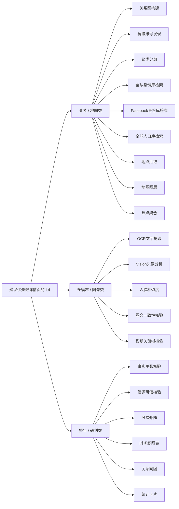

# 大屏节点渲染建议流程图

> 用途：给领导快速确认大屏第一屏应该重点展示哪些节点，以及哪些 L4 节点值得做详情页。

---

## 一、渲染原则

1. **优先展示分析、多模态、地图、关系网络、报告生成类节点**
2. **采集类节点只展示少量代表性平台**
3. **L4 详情页只做大屏真正显示、且看起来“更强、更直观”的节点**

---

## 二、首页渲染流程图

```mermaid
flowchart TD
    A[大屏首页节点树] --> B[账号核查智能体]
    A --> C[报告生产智能体]
    A --> D[多平台账号扫描]
    A --> E[采集智能体]

    B --> B1[相似账号认定Agent]
    B --> B2[社工库ES核验Agent]
    B --> B3[关系网络分析Agent]
    B --> B4[地理位置核验Agent]
    B --> B5[陕西谣言特色库Agent]
    B --> B6[图片流核验Agent]
    B --> B7[文本流核验Agent]

    C --> C1[图片流Agent分析]
    C --> C2[观点与涉华分析Agent]
    C --> C3[PII与圈层分析Agent]
    C --> C4[画像报告生成Agent]
    C --> C5[时间线写作Agent]
    C --> C6[关系网可视化Agent]

    D --> D1[Maigret跨平台扫描]
    D --> D2[网页检索扫描]
    D --> D3[以图搜图扫描]
    D --> D4[GitHub代码泄露扫描]
    D --> D5[Wayback快照扫描]

    E --> E1[Apify-Facebook-MCP采集]
    E --> E2[Youtube-MCP采集]
    E --> E3[微博-MCP采集]
    E --> E4[Telegram-Apify采集]

    style B fill:#d9ecff,stroke:#409eff,stroke-width:2px
    style C fill:#e8f8e8,stroke:#67c23a,stroke-width:2px
    style D fill:#fff3d9,stroke:#e6a23c,stroke-width:2px
    style E fill:#f4f4f5,stroke:#909399,stroke-width:1px
```

---

## 三、首页节点优先级

### 第一梯队：重点展示

- 相似账号认定Agent
- 社工库ES核验Agent
- 关系网络分析Agent
- 地理位置核验Agent
- 陕西谣言特色库Agent
- 图片流Agent分析
- 观点与涉华分析Agent
- PII与圈层分析Agent
- 画像报告生成Agent

### 第二梯队：辅助展示

- Maigret跨平台扫描
- 网页检索扫描
- 以图搜图扫描
- GitHub代码泄露扫描
- Apify-Facebook-MCP采集
- Youtube-MCP采集
- 微博-MCP采集

---

## 四、建议做详情页的 L4 节点

这些 L4 更适合点击后跳转到新页面，展示：

- 节点作用
- 对系统的帮助
- 示例图片

---

## 五、领导视角下的展示效果

如果按这版渲染，大屏首页传达出来的感觉会是：

1. **系统不只是“采集”，而是“发现 + 认定 + 关系分析 + 多模态研判 + 报告生成”**
2. **有图谱能力**：关系网络、桥接账号、聚类分组
3. **有空间能力**：地理位置、地图图层、热点聚合
4. **有多模态能力**：OCR、头像分析、人脸相似、图文一致、视频关键帧
5. **有报告能力**：观点分析、PII圈层、风险矩阵、时间线、终稿生成

---

## 六、建议的第一阶段工作

### 阶段 1：只优化大屏首页节点顺序

目标：

- 让首页先展示“核查、分析、关系、地图、报告”
- 采集节点保留少量代表性平台即可

### 阶段 2：给首页真正显示出来的 L4 做详情页数据

详情页统一展示：

1. 节点作用
2. 对系统的帮助
3. 示例图片

---

## 七、结论

建议首页的整体视觉重心，从“采集导向”改成：

**核查导向 + 研判导向 + 多模态导向 + 报告导向**

采集节点仍保留，但只作为能力补充，不再占据第一展示重心。

---

## 八、细化版 L4 渲染树（给领导看）

> 说明：
>
> 1. 这版是更接近主页大屏的层级树。
> 2. L3 数量比上一版略多。
> 3. L4 只挑“适合展示、看上去强”的节点，不追求把所有底层能力铺满。

```mermaid
flowchart LR
    A[共计包含220Agent]

    A --> B[账号核查智能体]
    A --> C[报告生产智能体]
    A --> D[多平台账号扫描]
    A --> E[采集智能体]

    B --> B1[相似账号认定Agent]
    B --> B2[社工库ES核验Agent]
    B --> B3[关系网络分析Agent]
    B --> B4[地理位置核验Agent]
    B --> B5[陕西谣言特色库Agent]
    B --> B6[图片流核验Agent]
    B --> B7[文本流核验Agent]

    B1 --> B11[相似度打分]
    B1 --> B12[种子必进收敛]
    B1 --> B13[认定结果摘要]

    B2 --> B21[全球身份库检索]
    B2 --> B22[Facebook身份库检索]
    B2 --> B23[全球人口库检索]

    B3 --> B31[关系图构建]
    B3 --> B32[桥接账号发现]
    B3 --> B33[聚类分组]

    B4 --> B41[地点抽取]
    B4 --> B42[地图图层]
    B4 --> B43[热点聚合]

    B5 --> B51[谣言特征匹配]
    B5 --> B52[区域话题聚合]
    B5 --> B53[高风险样本标记]

    B6 --> B61[OCR文字提取]
    B6 --> B62[Vision头像分析]
    B6 --> B63[人脸相似度]

    B7 --> B71[文本核验结论输出]
    B7 --> B72[规则比对核验]
    B7 --> B73[简介相似度]

    C --> C1[图片流Agent分析]
    C --> C2[观点与涉华分析Agent]
    C --> C3[PII与圈层分析Agent]
    C --> C4[画像报告生成Agent]
    C --> C5[时间线写作Agent]
    C --> C6[关系网可视化Agent]
    C --> C7[风险矩阵Agent]

    C1 --> C11[多模态分析]
    C1 --> C12[图文一致性核验]
    C1 --> C13[视频关键帧核验]

    C2 --> C21[观点归纳]
    C2 --> C22[涉华倾向识别]
    C2 --> C23[信源可信核验]

    C3 --> C31[PII识别]
    C3 --> C32[圈层分析]
    C3 --> C33[关联风险标记]

    C4 --> C41[账号基本信息章节]
    C4 --> C42[摘要生成]
    C4 --> C43[终稿组装输出]

    C5 --> C51[事件抽取]
    C5 --> C52[时间排序]
    C5 --> C53[叙事成稿]

    C6 --> C61[关系构图]
    C6 --> C62[关系网图]
    C6 --> C63[图导出]

    C7 --> C71[风险打分]
    C7 --> C72[风险矩阵]
    C7 --> C73[处置建议]

    D --> D1[Maigret跨平台扫描]
    D --> D2[网页检索扫描]
    D --> D3[以图搜图扫描]
    D --> D4[GitHub代码泄露扫描]
    D --> D5[Wayback快照扫描]
    D --> D6[证书透明度扫描]

    D1 --> D11[用户名跨平台收集]
    D1 --> D12[站点命中汇总]
    D1 --> D13[命中结果导出]

    D2 --> D21[搜索引擎检索]
    D2 --> D22[页面正文抽取]
    D2 --> D23[社交站点定向检索]

    D3 --> D31[Google以图搜图]
    D3 --> D32[Yandex以图搜图]
    D3 --> D33[TinEye检索]

    D4 --> D41[代码检索]
    D4 --> D42[Gist检索]
    D4 --> D43[密钥模式匹配]

    D5 --> D51[CDX索引检索]
    D5 --> D52[快照抓取]
    D5 --> D53[版本对比]

    D6 --> D61[子域枚举]
    D6 --> D62[证书详情]
    D6 --> D63[结果导出]

    E --> E1[Apify-Facebook-MCP采集]
    E --> E2[Youtube-MCP采集]
    E --> E3[微博-MCP采集]
    E --> E4[Telegram-Apify采集]
    E --> E5[抖音-MCP采集]
    E --> E6[小红书-MCP采集]

    E1 --> E11[用户主页采集]
    E1 --> E12[历史发文采集]
    E1 --> E13[粉丝列表检索]

    E2 --> E21[频道统计采集]
    E2 --> E22[视频列表采集]
    E2 --> E23[评论采样采集]

    E3 --> E31[用户主页采集]
    E3 --> E32[动态列表采集]
    E3 --> E33[视频号采集]

    E4 --> E41[频道主页采集]
    E4 --> E42[消息列表采集]
    E4 --> E43[成员采样采集]

    E5 --> E51[用户主页采集]
    E5 --> E52[视频列表采集]
    E5 --> E53[评论采样采集]

    E6 --> E61[用户主页采集]
    E6 --> E62[笔记列表采集]
    E6 --> E63[笔记检索]
```

---

## 九、这版树图的设计意图

### 1. 第一眼先看到“核查 + 报告”

把最能体现系统价值的能力放在视觉上半区：

- 相似账号认定
- 社工库核验
- 关系网络
- 地理位置
- 观点分析
- PII圈层
- 报告生成

### 2. 扫描能力保留，但不喧宾夺主

扫描类展示：

- Maigret
- 网页检索
- 以图搜图
- GitHub 泄露
- Wayback
- 证书透明度

这样既能体现“发现能力强”，又不会把页面重心拉回传统采集。

### 3. 采集类只保留熟悉平台

采集类只留几个平台型节点，给人“覆盖广”的印象：

- Facebook
- YouTube
- 微博
- Telegram
- 抖音
- 小红书

### 4. L4 优先挑可讲故事的

L4 不是为了铺满，而是为了让点击进入详情页后，能立刻讲清：

1. 这个能力是干什么的
2. 它对系统有什么帮助
3. 它能给出怎样的图/示例结果

