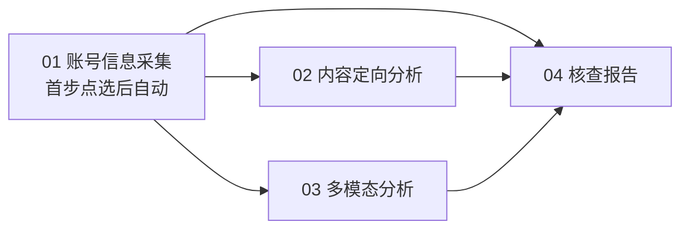

# 账号智能分析平台 — 总览与框架设计

> 面向零基础读者：看完本文，你能知道 **Hermes 是什么**、**文件在哪改**、**我们 4 类业务怎么落地**。  
> 项目根目录：`D:\hermes-xa`（下文简称 **HERMES_HOME**）

---

## 一、用一句话说清楚我们在做什么

我们要做一个 **「像密塔 AI 一样」的账号分析系统**：

1. 用户提出需求（例如：推特平台的李老师）
2. 系统在**第一步**让用户点选一次（如：是否跨平台采集）
3. 之后 **自动执行** 跨平台发现、核验、特征流校验、分平台采集 —— **过程中不再点选**
4. 过程数据 **全部入库**，不依赖聊天记录
5. 可按需进入 **深度多模态分析** 与 **核查报告**

一共 **4 类业务**：

| # | 业务 | Skill 名（规划） | 详细流程文档 |
|---|------|------------------|--------------|
| 1 | **账号信息采集**（一体化） | `account-intelligence-collect` | [01-账号信息采集.md](workflows/01-账号信息采集.md) |
| 2 | 内容定向分析 | `account-content-analysis` | *待编写* |
| 3 | 账号多模态分析 | `account-multimodal` | [04-账号多模态分析.md](workflows/04-账号多模态分析.md) |
| 4 | 核查报告 | `account-verify-report` | [05-账号核查报告.md](workflows/05-账号核查报告.md) |

> **改版说明（2026-07-06）**：原 02 跨平台、03 账号核查 **并入** 第 1 类自动流程；原 01 过程中多次确认 **取消**，仅保留首步一次点选。  
> 存档：[02-跨平台](workflows/02-跨平台账号收集.md)、[03-核查](workflows/03-账号核查.md)。

---

## 二、Hermes 是什么？（小白版）

可以把 Hermes 想成 **「会调用工具的智能助手运行时」**，不是普通聊天网页：

```
┌─────────────┐     对话/指令      ┌──────────────────┐
│   你 / Java  │ ───────────────▶ │   Hermes Agent   │
│   前端系统   │ ◀─────────────── │  （大脑 + 调度）  │
└─────────────┘     结果/报告      └────────┬─────────┘
                                            │
              ┌─────────────────────────────┼─────────────────────────────┐
              ▼                             ▼                             ▼
        ┌──────────┐                  ┌──────────┐                  ┌──────────┐
        │  Skill   │                  │   MCP    │                  │  MySQL   │
        │ 业务手册 │                  │ 数据采集 │                  │  持久化  │
        └──────────┘                  └──────────┘                  └──────────┘
```

| 概念 | 通俗解释 | 你要改什么 |
|------|----------|------------|
| **Hermes Agent** | 接模型、跑对话、决定调哪个工具 | `config.yaml` 里的模型地址 |
| **Skill** | 给 Agent 看的「业务操作手册」：步骤、格式、禁止事项 | `skills/` 下每个业务的 `SKILL.md` |
| **MCP** | 真正干活的「插件」：微博搜索、Twitter 拉帖、OCR 等 | `mcp/mcp_servers.yaml` |
| **clarify** | 内置工具：向用户提问、等用户选完再继续（密塔深度模式核心） | 写在 Skill 里规定何时必须 clarify |
| **Session** | 一次对话的上下文（会越聊越长） | 我们用 **入库** 减轻对它的依赖 |
| **Hook** | 对话生命周期里的自动脚本（提问前/工具后/回答后） | `config.yaml` + `scripts/` |
| **tool_search** | MCP 太多时，工具不直接列出，要搜索后调用 | `config.yaml` → `tools.tool_search` |

官方介绍：[Hermes Agent](https://hermes-agent.org/zh/#features)

---

## 三、HERMES_HOME 目录地图（改东西先找这里）

```
D:\hermes-xa\
├── config.yaml          ★ 总配置：模型、MCP、Hook、工具开关
├── .env                 ★ 密钥：Cookie、API Key、代理
├── hermes-agent\        程序源码（一般不改，用 hermes update 升级）
│
├── mcp\                 ★ MCP 集中目录
│   ├── mcp_servers.yaml    MCP 配置源文件
│   ├── install.ps1         合并到 config.yaml
│   ├── README.md           MCP 安装说明
│   └── servers\            自研 MCP 源码
│
├── skills\              ★ 业务 Skill（我们要在这里加 4 个）
│   └── account-intelligence\
│       ├── account-intelligence-collect\SKILL.md   # 01 一体化采集 ✅ v1
│       ├── account-content-analysis\SKILL.md       # 02 待建
│       ├── account-multimodal\SKILL.md
│       └── account-verify-report\SKILL.md
│
├── scripts\             ★ 入库、证据包、清洗（规划新建）
│   ├── db_sink.py
│   └── evidence_builder.py
│
├── docs\
│   ├── 平台总览与框架设计.md   ← 本文
│   └── workflows\              4 类业务流程细节
│
├── sessions\            对话记录（SQLite，自动生成）
├── logs\                运行日志
└── cron\                定时任务（后期巡检用）
```

### 3.1 最常改的 4 个文件

| 想做什么 | 改哪里 | 改完怎么办 |
|----------|--------|------------|
| 换模型 / API 地址 | `config.yaml` → `model` | 重启 `hermes chat` |
| 加/关 MCP | `mcp/mcp_servers.yaml` → 运行 `mcp/install.ps1` | 会话里 `/reload-mcp` |
| 改业务步骤和提示词 | `skills/.../SKILL.md` | 新开会话或 `/skill 名` |
| 改 Cookie、代理 | `.env` | 重启 Hermes |

### 3.2 零基础日常操作

```powershell
# 1. 进入项目
cd D:\hermes-xa

# 2. 启动对话
hermes chat

# 3. 会话内常用命令
/tools          # 看当前可用工具（MCP 多时会走 tool_search，见下文）
/reload-mcp     # 改完 MCP 配置后重载
/skill 名       # 加载某个 Skill 流程

# 4. 首次配置模型（已配过可跳过）
hermes setup
```

### 3.3 为什么 /tools 里看不到微博工具？

你接了 **13 个 MCP、169 个工具**，Hermes 默认开启 **Tool Search（按需加载）**：

- `/tools` 只显示约 30 个核心工具 + `tool_search` / `tool_call`
- **169 个 MCP 工具仍在**，模型通过 `tool_search("微博")` 找到再调用

若希望全部直接列出，在 `config.yaml` 增加：

```yaml
tools:
  tool_search:
    enabled: off
```

（会显著增加每轮 token 消耗。）

---

## 四、四类业务 = 四个 Skill 流程

### 4.1 统一交互模式：密塔式「首步点选，后续自动」

**第 1 类（账号信息采集）** 对齐密塔 AI：

```
用户下发任务
    → 【唯一确认点】是否跨平台采集？（用户点选一次）
    → 阶段 2～8 全自动（跨平台检索 → 核验 → 特征流 → 流校验 → 分平台采集）
    → 结果入库 + 摘要展示
```

| 规则 | 说明 |
|------|------|
| **仅首步点选** | 除「跨平台是/否」外，**禁止**过程中 `clarify` |
| **进度只读** | 前端展示 `current_phase`，用户不中途改参 |
| **改意图** | 须 **新建任务** |
| **第 2～4 类** | 交互细则在各自 workflow 文档中定义（待与首步模式对齐） |

Skill 里要写清：

- 唯一确认点的 `step_key` 与选项
- 各自动阶段的顺序、可用 MCP、失败是否继续
- 输出 JSON 契约与入库表

### 4.2 四类 Skill 差异一览

| Skill | 主要 MCP | 提示词重点 | 输出形态 |
|-------|----------|------------|----------|
| **account-intelligence-collect** | maigret、各平台 profile/search/feeds | **首步后全自动**；特征流生成与校验；分平台采集 | 已校验账号清单 + profiles + posts |
| **account-content-analysis** | 各平台 content 搜索 | 关键词/时间定向解读（待细化） | 内容分析条目入库 |
| **account-multimodal** | ocr、vision、视频 | 对疑点媒体深度分析 | multimodal_findings |
| **account-verify-report** | **禁止调 MCP** | 只许引用证据 ID | Markdown/JSON 报告 |

### 4.3 Skill 文件规划（待创建）

```
skills/account-intelligence/
├── account-intelligence-collect/
│   ├── SKILL.md
│   └── references/
│       ├── confirm-points.yaml    # 仅 collect.cross_platform
│       └── phases.yaml            # 自动阶段顺序与默认采集参数
├── account-content-analysis/
│   └── SKILL.md
├── account-multimodal/
│   └── SKILL.md
└── account-verify-report/
    └── SKILL.md
```

使用方式：

```text
/account-intelligence-collect 推特平台的李老师
```

### 4.4 四类业务串联关系



任意环节可 **单独入口** 启动；推荐主路径为 **01 →（可选 02/03）→ 04**，通过 `task_id` / `parent_task_id` 关联。

---

## 五、框架架构设计（核心）

### 5.1 分层架构

```
┌─────────────────────────────────────────────────────────────┐
│  接入层：hermes chat / Gateway API / Java HTTP（后期）        │
└────────────────────────────┬────────────────────────────────┘
                             │
┌────────────────────────────▼────────────────────────────────┐
│  编排层：4 × Skill（首步 clarify + 自动阶段机 + 输出契约）      │
└────────────────────────────┬────────────────────────────────┘
                             │
┌────────────────────────────▼────────────────────────────────┐
│  执行层：MCP 工具（mcp/ 下 14 个 server）                     │
└────────────────────────────┬────────────────────────────────┘
                             │
┌────────────────────────────▼────────────────────────────────┐
│  持久层：Hook 脚本 → MySQL（任务、步骤、工具输出、业务分表）   │
└────────────────────────────┬────────────────────────────────┘
                             │
┌────────────────────────────▼────────────────────────────────┐
│  成稿层：证据包（短上下文）→ 报告 Skill → 报告表              │
└─────────────────────────────────────────────────────────────┘
```

**设计原则：**

1. **数据库是真源**，聊天记录只是过程载体  
2. **采集阶段** 可以长上下文 + 多轮 MCP  
3. **报告阶段** 短上下文，只喂证据包，避免超长对话爆 context  
4. **首步选择** 写入 `hermes_task_steps`；自动阶段进度写 `hermes_tasks.current_phase`（待扩展）

### 5.2 任务与上下文模型

#### 核心 ID

| 字段 | 含义 |
|------|------|
| `task_id` | 一次业务任务唯一 ID（建议 UUID，Java 生成或 Hermes 首条 clarify 后生成） |
| `session_id` | Hermes 会话 ID（一次 chat 线程） |
| `task_type` | `collect` / `cross_platform` / `verify` / `multimodal` / `report` |
| `parent_task_id` | 上游任务（如报告关联的核查任务） |

#### 两类 Session（解决上下文爆炸）

| 阶段 | Session 类型 | 能否调 MCP | 上下文内容 |
|------|--------------|------------|------------|
| **执行态** `session_id` | 采集/检索/核查/多模态 | 能 | 当前步骤 + 最近几轮工具结果摘要 |
| **成稿态** `session_id:draft` | 仅 05 报告 | **不能** | 仅证据包（从 MySQL 构建，通常 &lt; 8K tokens） |

> 同一 `task_id` 下，执行态与成稿态 **事件都归并到同一任务**，但成稿会话 **不带历史 tool 输出**，防止 262K 仍不够用。

#### 上下文裁剪策略

| 时机 | 做法 |
|------|------|
| 每次 MCP 返回后 | Hook 把 **完整原始 JSON** 写入 MySQL；对话里只保留 **200 字摘要** |
| 跨确认点 | 从 `task_step` 表读用户已选参数，**不依赖**模型记忆 |
| 进入下一 Skill | 新 `task_type`，可新开会话，用 `task_id` 串起来 |
| 05 写报告 | `evidence_builder.py` 按 `task_id` 拼证据包，注入 draft session |

### 5.3 入库设计（MySQL）

完整设计见 **[MySQL数据库设计.md](MySQL数据库设计.md)**（18 张表、三层存储、改表指南）。  
**01 开工**见 **[MySQL-01账号采集表设计.md](MySQL-01账号采集表设计.md)**（Java 首步 + 10 张表）。  
01 采集入库见 **[normalizers架构设计.md](normalizers架构设计.md)**（平台字段映射、Hook 管线）。

库名建议：`hermes-xa`。建表脚本：

```bash
mysql -u root -p < scripts/sql/001_init_core.sql
mysql -u root -p < scripts/sql/002_init_business.sql
```

#### 5.3.1 三层结构（摘要）

| 层 | 表 | 作用 |
|----|-----|------|
| **审计** | `hermes_tool_outputs` | MCP 完整原始 JSON，不改 |
| **编排** | `hermes_tasks`、`hermes_task_steps` | 任务状态 + Clarify 每步选择 |
| **业务** | `collect_*` / `cross_platform_*` / `verify_*` / `multimodal_*` / `verify_reports` | Java 查询、报告证据包 |

改表策略：**不用 ENUM**；不确定字段先放 `extra_json`；按 `scripts/sql/00N_*.sql` 编号迁移。

#### 5.3.2 通用表（核心 DDL 摘要）

```sql
-- 任务主表
CREATE TABLE hermes_tasks (
    task_id       VARCHAR(64)  PRIMARY KEY,
    task_type     VARCHAR(32)  NOT NULL COMMENT 'collect/cross_platform/verify/multimodal/report',
    session_id    VARCHAR(64)  NULL,
    parent_task_id VARCHAR(64) NULL,
    status        VARCHAR(16)  NOT NULL DEFAULT 'pending' COMMENT 'pending/running/waiting_user/completed/failed',
    subject_json  JSON         NULL COMMENT '本人参照、锚定账号等',
    created_at    DATETIME(3)  NOT NULL,
    updated_at    DATETIME(3)  NOT NULL,
    KEY idx_type_status (task_type, status),
    KEY idx_session (session_id)
);

-- 确认点 / 用户选择（密塔深度模式每一步）
CREATE TABLE hermes_task_steps (
    id            BIGINT       AUTO_INCREMENT PRIMARY KEY,
    task_id       VARCHAR(64)  NOT NULL,
    step_key      VARCHAR(64)  NOT NULL COMMENT '如 collect.keyword_confirm',
    step_order    INT          NOT NULL,
    question      TEXT         NOT NULL,
    options_json  JSON         NULL,
    user_choice   TEXT         NULL,
    chosen_at     DATETIME(3)  NULL,
    KEY idx_task (task_id)
);

-- 用户原始提问
CREATE TABLE hermes_user_questions (
    question_id   VARCHAR(64)  PRIMARY KEY,
    task_id       VARCHAR(64)  NOT NULL,
    session_id    VARCHAR(64)  NOT NULL,
    user_question TEXT         NOT NULL,
    asked_at      DATETIME(3)  NOT NULL
);

-- 工具调用明细（完整输出，不截断）
CREATE TABLE hermes_tool_outputs (
    id            BIGINT       AUTO_INCREMENT PRIMARY KEY,
    task_id       VARCHAR(64)  NOT NULL,
    question_id   VARCHAR(64)  NULL,
    mcp_server    VARCHAR(64)  NULL,
    tool_name     VARCHAR(128) NOT NULL,
    tool_args     JSON         NULL,
    tool_output   LONGTEXT     NOT NULL,
    tool_call_id  VARCHAR(128) NOT NULL,
    duration_ms   INT          NULL,
    status        VARCHAR(16)  NULL,
    executed_at   DATETIME(3)  NOT NULL,
    UNIQUE KEY uk_tool_call (tool_call_id),
    KEY idx_task (task_id)
);
```

#### 5.3.3 业务分表（按 Skill 产出）

| Skill | 表名（示例） | 存什么 |
|-------|--------------|--------|
| 01 采集 | `collect_profiles`、`collect_posts` | 账号资料、帖子、评论 |
| 02 跨平台 | `cross_platform_candidates`、`entity_accounts` | 候选账号、实体图谱 |
| 03 核查 | `verify_account_results` | 每账号 verdict + 证据 ID 列表 |
| 04 多模态 | `multimodal_findings` | 图文/视频分析条目 |
| 05 报告 | `verify_reports` | 报告正文、版本号、格式 |

分表字段与 JSON 结构见各 `docs/workflows/0x-*.md` 的「数据输出结构」章节。

### 5.4 Hook 管线（自动入库，无需模型记得写库）

在 `config.yaml` 配置（规划路径 `scripts/db_sink.py`）：

```yaml
hooks:
  - event: pre_llm_call
    command: D:/environment/python/python.exe D:/hermes-xa/scripts/db_sink.py
  - event: post_tool_call
    command: D:/environment/python/python.exe D:/hermes-xa/scripts/db_sink.py
  - event: post_llm_call
    command: D:/environment/python/python.exe D:/hermes-xa/scripts/db_sink.py
hooks_auto_accept: true
```

| 事件 | 脚本职责 |
|------|----------|
| `pre_llm_call` | 解析 session→task_id；补任务记录；若 draft session 则注入证据包摘要到 metadata |
| `post_tool_call` | 完整 tool 输出写入 `hermes_tool_outputs` + 业务分表 |
| `post_llm_call` | 若当前为报告 Skill，把成稿写入 `verify_reports`；更新 `task.status` |

`.env` 中配置数据库：

```env
HERMES_DB_HOST=127.0.0.1
HERMES_DB_PORT=3306
HERMES_DB_USER=root
HERMES_DB_PASSWORD=你的密码
HERMES_DB_NAME=hermes-xa
```

### 5.5 证据包（给 05 报告用的短上下文）

`scripts/evidence_builder.py`：只读 MySQL，按 `task_id` 生成 JSON：

```json
{
  "task_id": "uuid",
  "subject": { "name": "张三", "anchor_account": "..." },
  "collect_summary": { "platforms": ["weibo"], "post_count": 30 },
  "candidates": [ "..." ],
  "verify_results": [ { "account": "...", "verdict": "self_authentic", "evidence_ids": ["ev_001"] } ],
  "multimodal_highlights": [ "..." ]
}
```

报告 Skill **只能引用 `evidence_ids` 中存在的证据**，禁止调用 MCP 重新采集。

### 5.6 MCP 调用策略（按 Skill 约束）

在各自 `SKILL.md` 头部用 YAML front matter 或表格写死：

| Skill | 允许 MCP | 禁止 |
|-------|----------|------|
| account-collect | 单平台 content/profile 类 | maigret、跨平台 search |
| cross-platform-collect | maigret、search_users | 深度爬全量帖子 |
| account-verify-batch | get_profile、轻量 refresh | 大规模 comment 爬取（除非用户确认） |
| account-multimodal | ocr、vision、视频 | web_search 代替平台 MCP |
| account-verify-report | **无** | 任何 MCP |

可选：在 `config.yaml` 用 `mcp_servers.*.tools.include` 做硬限制（已在 twitter 去掉 persona 工具）。

### 5.7 与 Java / 前端的对接（后期）

详见 [Clarify 指南 · 第七节（选项自定义）](clarify深度交互与Skill集成指南.md#七faq选项能否自定义如何定规则) 与 [第八节（Java 对接）](clarify深度交互与Skill集成指南.md#八faq与-java-前端如何打通)。

**推荐路径（短期可落地）**：

```
Java 创建 task_id + INSERT hermes_tasks
    → POST /api/sessions + chat/stream（SSE）
    → Java 按 confirm-points.yaml 渲染确认 UI（方案 A）
    → 用户点选 → Java 写 hermes_task_steps
    → 再 POST chat/stream，input=[系统确认] step_key=... user_choice=...
    → Hermes 继续执行 MCP → Hook 落库
    → 完成后从 verify_reports / 各分表读结果
```

> **注意**：v0.18 API Server 尚未内置 `clarify.request` SSE 事件；若要与 CLI 完全一致的原生 clarify，需扩展 API（方案 B，见 Clarify 指南第八节）。

Gateway API 在 `.env` 中按需开启 `API_SERVER_*`（当前新环境默认未开，需要时再配）。

---

## 六、端到端示例（帮助建立直觉）

**场景**：推特「李老师」→ 首步选跨平台 → 自动核验与流校验 → 分平台采集 →（可选）出报告

| 步骤 | 用户/系统 | 数据落库 |
|------|-----------|----------|
| 1 | Java 生成 `task_id`，用户：「推特平台的李老师」 | `hermes_tasks` |
| 2 | **唯一 clarify**：是否跨平台？→ 用户点「是」 | `hermes_task_steps` |
| 3 | 自动：解析种子 + maigret 跨平台检索 | `cross_platform_candidates` |
| 4 | 自动：真实性核验 + 特征流生成与校验 | `verify_*` / 流表（待建） |
| 5 | 自动：分平台 `mcp_*` 采集 | `collect_profiles` + `collect_posts` |
| 6 | （可选）`/account-verify-report` 成稿 | `verify_reports` |

全程用户 **只点选 1 次**；进度靠 `current_phase` + 入库，不靠聊天记录。

---

## 七、实施路线图（建议顺序）

| 阶段 | 内容 | 产出 |
|------|------|------|
| **P0** | 模型 + MCP 跑通（当前） | `hermes chat` 能调微博 |
| **P1** | 建表 + `db_sink.py` Hook | 工具输出自动入库 |
| **P2** | Skill `account-intelligence-collect` 端到端 | 01 首步点选 + 自动八阶段 |
| **P3** | 多模态 + 报告 Skill | 03、04 类业务 |
| **P4** | Java API + 首步确认 UI | 密塔式一次点选 |
| **P5** | Cron 定时巡检（可选） | 自动舆情/热榜 |

---

## 八、你要改东西时的速查表

| 需求 | 位置 |
|------|------|
| 业务步骤、话术、禁止编造 | `skills/account-intelligence/*/SKILL.md` |
| 某类业务能用哪些 MCP | 同上 + `mcp/mcp_servers.yaml` |
| 加一个新平台 MCP | `mcp/servers/` 或 pip 安装 → `mcp_servers.yaml` → `install.ps1` |
| 入库字段、表结构 | [MySQL数据库设计.md](MySQL数据库设计.md) + `scripts/sql/` |
| 报告引用的证据从哪来 | `evidence_builder.py` |
| 模型地址、context 长度 | `config.yaml` → `model` / `custom_providers` |
| 代理、Cookie | `.env` |
| 5 类业务交互细节 | `docs/workflows/0x-*.md`（01 为主，02/03 已并入存档） |

---

## 九、术语表

| 术语 | 解释 |
|------|------|
| MCP | Model Context Protocol，Hermes 调外部能力的标准方式 |
| Skill | Markdown 写的业务规程，Agent 按需阅读 |
| clarify | 向用户提问并等待选择，实现「先选后执行」 |
| tool_search | MCP 过多时的按需工具发现机制 |
| task_id | 业务任务主键，串联入库与多 Session |
| 证据包 | 从数据库抽出的精简事实，供报告阶段使用 |
| draft session | 成稿专用会话，禁止工具调用 |

---

## 十、相关文档

- [MySQL 数据库设计](MySQL数据库设计.md) — **表结构、改表指南、01 人物/发文分表**
- [Normalizers 架构设计](normalizers架构设计.md) — **MCP JSON → 业务表映射与入库管线**
- [Clarify 深度交互与 Skill 集成指南](clarify深度交互与Skill集成指南.md) — **本项目核心亮点**（含选项自定义 FAQ、Java 对接 FAQ）
- [MCP 安装说明](../mcp/README.md)
- [01 账号信息采集](workflows/01-账号信息采集.md)
- [02 跨平台账号收集](workflows/02-跨平台账号收集.md)
- [03 账号核查](workflows/03-账号核查.md)
- [04 账号多模态分析](workflows/04-账号多模态分析.md)
- [05 账号核查报告](workflows/05-账号核查报告.md)
- Hermes 官方 Tool Search 说明：`hermes-agent/website/docs/user-guide/features/tool-search.md`

---

*文档版本：2026-07-03 · 随 Skill 与入库脚本落地持续更新*
