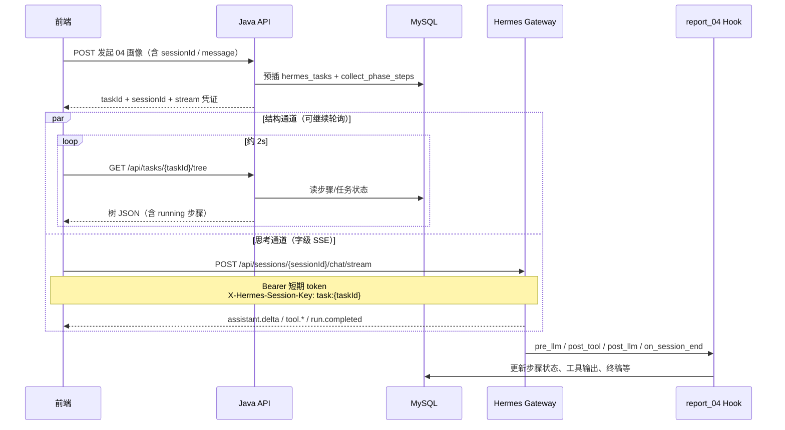

# 模型思考过程流式展示方案（04 画像 · 草案）

> **状态**：历史草案，**落地请勿按本文改代码**。  
> **现行实施方案（已拍板）**：[`思考流与步骤树同步落库实施方案.md`](思考流与步骤树同步落库实施方案.md)  
> **原范围说明**：曾计划先做 04；现行方案为四业务共用中继，映射优先 03+01。  
> **相关文档**：[账号采集-前端深度模式开发指南.md](账号采集-前端深度模式开发指南.md) · [gateway-会话与多轮对话指南.md](gateway-会话与多轮对话指南.md) · [clarify深度交互与Skill集成指南.md](clarify深度交互与Skill集成指南.md)

---

## 一、甲方诉求（产品语言）

甲方希望前端能展示 **模型的自主思考流程**，体验接近在 Hermes Chat 提问时看到的效果：

- 模型在执行每一步 / 调用工具前，会先生成一段「进度叙述」  
- 例如：「因为要确认种子主页，所以选择调用 `get_user_info`…」  
- 叙述要能 **流式**（尽量字级）出现在页面上  
- 叙述展示要与现有的 **树结构流程图**（步骤状态：pending / running / completed / failed / skipped）**同步联动**

本方案先解决「工具前叙述（A）」；内部推理链（B，reasoning）后补且架构兼容。

---

## 二、需求澄清记录（问答结论）

与内部澄清时的选择如下，**甲方沟通后可改表内「结论」列**。

| # | 问题 | 选项摘要 | 当前结论 |
|---|------|----------|----------|
| 1 | 「思考过程」是什么内容？ | A=工具前叙述；B=内部 reasoning；C=两者都要 | **期望 C**；若先做 A、后加 B 成本低 → **第一期只做 A** |
| 2 | 与树结构如何联动？ | A=挂节点下；B=侧栏时间线+树高亮；C=节点摘要+时间线 | **B 或 C**（甲方未定）；**C 最完美，B 实现更轻** |
| 3 | 前端进度通道现状？ | A=已有 SSE/WS；B=纯轮询；C=无通道 | **现用轮询**；可改造，不强制继续轮询 |
| 4 | 任务结束后 / 刷新后要不要回放？ | A=仅实时；B=必须落库；C=先实时、落库预留 | **C** |
| 5 | 前端是否只能走 Java？ | A=一律经 Java；B=思考流可直连 Hermes；C=按 A 设计 | **B**（思考流允许直连 Hermes） |
| 6 | 叙述与步骤如何归属？ | A=挂当前 running 步骤；B=先未归属再按工具映射；C=宽松时间线+树只高亮 running | **C（宽松）** |
| 7 | 哪些 assistant 文本进「思考面板」？ | A=仅中间叙述；B=全部（含终稿），UI 分区；C=先全收再过滤 | **B** |
| 8 | 第一期覆盖哪些业务？ | A=仅 04；B=01+04；C=四类全开 | **仅 04**，完善后再扩到其他三类 |
| 9 | 流式粒度？ | A=字级；B=句/段级；C=先段后字 | **A（字级）** |

### 2.1 内容分层（A / B）

| 代号 | 含义 | 第一期 | 说明 |
|------|------|--------|------|
| **A** | 工具调用前/之间的助手叙述（interim assistant messages） | ✅ 做 | 接近 Hermes Chat 可见进度句 |
| **B** | 模型内部 reasoning / chain-of-thought | ❌ 后补 | 依赖模型是否吐 reasoning、Gateway 是否发对应 SSE；与 A **同一套时间线/事件模型**，事件类型不同即可 |

### 2.2 展示路线（B 与 C）

| 路线 | UI | 同步规则 | 实现量 |
|------|-----|----------|--------|
| **B** | 树（原样）+ **独立「思考过程」时间线** | 树只高亮 `running`；时间线按时间排，不强绑 step | **小（推荐 P0）** |
| **C** | B + **节点下一行 live 摘要** | 当前 `running` 步骤显示最近叙述尾部；步骤切换时快照到上一节点 | 中（P1，在 B 上增量） |

**建议**：甲方未定前，代码与接口按 **B 交付，预留 C 的 `thoughtPreview` 槽位**。

---

## 三、设计原则

1. **双通道分离**：步骤树 = 结构化状态；思考流 = 对话字级流。不混在同一轮询接口里硬模拟字级流。  
2. **弱耦合同步**：树与思考以「时间相近 + 当前 running 步骤」联动，不要求每句精确绑定 `step_key`。  
3. **先体验、后回放**：P0 保证实时字级；落库与 `GET .../thoughts` 表结构/接口先设计，写入可第二期再做。  
4. **安全**：浏览器**不得**长期持有 Gateway 的 `API_SERVER_KEY`；直连须用短期 token，或降级为 Java SSE 中继。  
5. **仅 04**：第一期只对 `task_type = account_report` 打开思考面板。

---

## 四、总体架构



| 通道 | 数据来源 | 传输 | 职责 |
|------|----------|------|------|
| **结构通道** | MySQL `collect_phase_steps` + `hermes_tasks` | 现：`GET /api/tasks/{taskId}/tree` 轮询；后期可改 WS | 步骤树状态、高亮 running |
| **思考通道** | Hermes Gateway SSE | 前端直连 `chat/stream`（或经 Java 中继） | 字级叙述、工具起止事件 |

### 4.1 现有能力依据

- `config.yaml`：`display.streaming: true`、`display.interim_assistant_messages: true`  
- Java：`HermesGatewayClient` 已能异步消费 Gateway SSE（`event:` / `data:`）  
- 文档约定事件：`run.started`、`tool.started`、`tool.completed`、`assistant.delta`、`run.completed`  
  - 见 [gateway-会话与多轮对话指南.md](gateway-会话与多轮对话指南.md)、[clarify深度交互与Skill集成指南.md](clarify深度交互与Skill集成指南.md) §8.4  
- 进度树：Java `TaskTreeQueryService` + 前端现有轮询（见深度模式指南）

> **落地前需实测**：当前 Gateway 版本对 `assistant.delta` 的字段名（`text` / `delta` / `content`）及是否在每个 tool 前必发 interim 叙述；以联调结果微调前端解析。

---

## 五、路线 B（P0）详细设计

### 5.1 页面布局（示意）

```
┌─────────────────────────────┬──────────────────────────────┐
│  04 步骤树（轮询 Java）        │  思考过程时间线（SSE 字级）      │
│  · 步骤一 running ●         │  …因为要确认种子…              │
│  · 步骤二 pending           │  🔧 mcp_twitter_get_user_info │
│  · …                        │  …接下来做 Maigret…           │
│                             │  （终稿块可折叠/分区到报告区）   │
└─────────────────────────────┴──────────────────────────────┘
```

### 5.2 与树同步（宽松）

- 每次 tree 轮询：找出 `status === "running"` 的步骤 → 树节点高亮/脉冲。  
- 时间线**不**强制写入 `stepKey`；可选在时间线顶部展示：「当前步骤：步骤三 · 网页检索」（文案来自 tree）。  
- Hook 改步骤通常落后于模型说话 1～2 个轮询周期 → **可接受**轻微不同步。

### 5.3 SSE 事件 → 时间线 UI

| Gateway 事件（预期） | 前端行为 |
|----------------------|----------|
| `assistant.delta` | 当前「思考气泡」末尾逐字追加 |
| `tool.started` | flush 当前气泡 → 插入工具条目标记 running |
| `tool.completed` | 更新工具条成功/失败（可选展示短错误） |
| `run.completed` / `done` | flush 剩余文本 → 结束本流、停止 loading |
| （后续）`reasoning.delta` | 入同一时间线，样式区分（灰/折叠）= 内容层 B |

### 5.4 内容边界与 UI 分区

- **入库/入时间线**：Agent 吐出的 **全部** assistant 文本（含终稿）都可以进时间线（澄清结论 B）。  
- **展示分区（前端规则，第一期不改 Hook）**：  
  - 「思考区」：工具循环过程中的 interim + 小段说明  
  - 「报告区」：`step11_report` 变为 `running` 之后的大段 assistant，和/或 `run.completed` 后的最后一大段  
- 启发式可调，甲方看样例后改规则即可。

### 5.5 前端字级状态机（伪代码）

```text
blocks = []
currentText = ""

on assistant.delta(chunk):
  currentText += chunk
  rerender(currentText)

on tool.started(name):
  if currentText.strip():
    blocks.push({ type: "thought", text: currentText })
  currentText = ""
  blocks.push({ type: "tool", name, status: "running" })

on tool.completed(name, ok):
  update last matching tool block status

on run.completed:
  if currentText.strip():
    blocks.push({ type: "thought", text: currentText })
  currentText = ""
  closeStream()
```

并行：

```text
poll GET /api/tasks/{taskId}/tree every 2s
  → highlight nodes where status == "running"
  → stop when task.status in (completed, failed)
```

---

## 六、路线 C（P1 增量）

在路线 B 全部能力之上：

1. 轮询得到 `runningStepKey`。  
2. `assistant.delta` 写入内存 `liveBuffer`。  
3. `runningStepKey` **变化**时：将旧 buffer 快照挂到**上一节点**的 `thoughtPreview`；清空 buffer。  
4. 当前 running 节点展示 `liveBuffer` 尾部约 80～120 字；完整内容仍在右侧时间线。  

接口侧建议 tree 节点预留：

```json
{
  "stepKey": "step1_seed",
  "status": "running",
  "thoughtPreview": null
}
```

第一期可由前端本地算 `thoughtPreview`，不必后端返回。

---

## 七、接口约定（草案）

### 7.1 发起 04 任务（扩展现有响应）

在现有 `POST /api/collect`（或实际使用的 start 接口）响应中增加 `stream` 字段：

```json
{
  "taskId": "5bbcc54c-4e31-407f-9b77-d43131089f51",
  "sessionId": "api_1784014343_965f47f5",
  "taskType": "account_report",
  "stream": {
    "url": "http://{gateway}/api/sessions/{sessionId}/chat/stream",
    "token": "<短期凭证>",
    "expiresAt": "2026-07-14T18:00:00+08:00",
    "headers": {
      "Authorization": "Bearer <短期凭证>",
      "Accept": "text/event-stream",
      "X-Hermes-Session-Key": "task:5bbcc54c-4e31-407f-9b77-d43131089f51"
    }
  }
}
```

说明：

- 真正触发 Agent 跑一轮的 `POST chat/stream`，**今天由 Java 在后台发出**；落地思考流时需明确二选一（见 §7.3）。  
- 前端若直连 Gateway，必须禁止把长期 Key 打进前端包。

### 7.2 刷新流凭证

```http
GET /api/tasks/{taskId}/stream-auth
```

仅当任务仍为 `pending`/`running` 时返回新短期 token；否则 409/410。

### 7.3 谁发起 chat/stream？（待甲方确认后技术拍板）

当前实现：**Java `submitCollectAsync` 消费 SSE 并丢弃/仅日志**，前端靠 tree 轮询。

字级展出给前端后，可选：

| 方案 | 做法 | 优点 | 缺点 |
|------|------|------|------|
| **S1 直连 fork** | Java 只建 session + 预插任务；**前端** POST chat/stream 开流 | 字级延迟最低；符合「可直连 Hermes」 | 需短期 token；重复提交风险需控 |
| **S2 Java 中继** | Java 仍 POST chat/stream；另开一条 **Java→前端 SSE/WS**，转发 `assistant.delta` 等 | 前端不碰 Gateway；密钥安全 | 多一跳；Java 要稳接长连接 |
| **S3 双订阅** | Gateway 若不支持多消费者则不可行 | — | 通常不可用 |

**草案默认倾向：P0 用 S2（Java 中继）或 S1（短期 token）二选一，落地周与运维/安全再定；产品体验目标相同。**

> 注意：同一 `session` 上同一时刻只应有一个 running 的 collect/report 流，与现有「同 session 同时只允许一个 pending/running 任务」约定一致。

### 7.4 结构通道（沿用）

```http
GET /api/tasks/{taskId}/tree
```

思考面板可额外读（任选）：

- `GET /api/tasks/{taskId}/final-answer`（报告区终稿）  
- `GET /api/tasks/{taskId}/steps/{stepKey}/data`（点节点详情）

### 7.5 回放通道（预留，P1）

```http
GET /api/tasks/{taskId}/thoughts?afterSeq=0
```

响应示例：

```json
{
  "taskId": "...",
  "events": [
    {
      "seq": 1,
      "eventType": "assistant_delta",
      "content": "因为",
      "toolName": null,
      "createdAt": "..."
    },
    {
      "seq": 12,
      "eventType": "tool_started",
      "content": null,
      "toolName": "mcp_twitter_get_user_info",
      "createdAt": "..."
    }
  ],
  "nextSeq": 13
}
```

---

## 八、落库预留（先设计，可不第一期写）

```sql
-- 草案表：模型思考 / 工具过程事件（字级或归并段级均可）
CREATE TABLE hermes_thought_events (
  id           BIGINT AUTO_INCREMENT PRIMARY KEY,
  task_id      VARCHAR(64)  NOT NULL,
  session_id   VARCHAR(64)  NOT NULL,
  seq          INT          NOT NULL,
  event_type   VARCHAR(32)  NOT NULL
      COMMENT 'assistant_delta|assistant_message|tool_started|tool_completed|reasoning_delta',
  content      MEDIUMTEXT   NULL,
  tool_name    VARCHAR(128) NULL,
  created_at   DATETIME(3)  NOT NULL,
  UNIQUE KEY uk_task_seq (task_id, seq),
  KEY idx_task_created (task_id, created_at)
) ENGINE=InnoDB DEFAULT CHARSET=utf8mb4;
```

**写入策略（后补）**

| 方案 | 谁写 | 粒度 | 说明 |
|------|------|------|------|
| 1（推荐） | Java 中继 SSE 时异步写 | 可字级 | 与实时流同源，回放最准 |
| 2 | Hook `post_llm_call` | 段级 | 实现快，但不够字级回放 |

---

## 九、分期与工作量粗估

| 阶段 | 交付物 | 粗估 |
|------|--------|------|
| **P0** | 路线 B；04 专用；字级流（中继或直连）；树轮询高亮 running；stream 凭证/安全 | 约 3～5 人天 |
| **P1** | 路线 C 节点摘要；`hermes_thought_events` + 回放 API；刷新 token | 约 2～3 人天 |
| **P2** | 内容层 B（reasoning）；可选树改 WS | 视模型与 Gateway 能力 |
| **P3** | 01/02/03 挂载同一思考组件 | 偏配置与前端开关 |

---

## 十、内容层 B（reasoning）后补路径

在 A 稳定后：

1. 主模型换为支持 reasoning 暴露的模型（如规划中的 gpt-5.6-sol）。  
2. `config.yaml`：`display.show_reasoning: true`（以 Hermes 实际配置项为准）。  
3. 前端订阅 `reasoning.delta`（或 Gateway 实际事件名），与 `assistant.delta` 同管道，UI 灰底/折叠区分。  
4. 落库 `event_type = reasoning_delta`。

**不需要第二套架构。**

---

## 十一、明确不做 / 不建议

| 做法 | 原因 |
|------|------|
| 仅用轮询 `tree` / dialogues **模拟**字级流 | 库里是整段文本，无 delta |
| Hook 按字实时入库 | Hook 多在 turn 末触发，时机太晚 |
| 第一期强绑每句到 `step_key` | 叙述早于步骤落库，归属易错 |
| 第一期四业务齐开 | 先验证 04 |

---

## 十二、与现有「深度模式」关系

| 已有（深度模式） | 本方案新增 |
|------------------|------------|
| 步骤树状态流式感（轮询） | 模型叙述 **字级** 流式 |
| 点节点看工具入参出参 | 工具条在时间线侧展示起止 |
| 终稿 `final-answer` | 时间线可冗余收录全文，报告区仍可走原接口 |
| Java 后台消费 SSE 不落前端 | 必须把 delta **转给前端**（中继或直连） |

本方案是深度模式的 **P0 体验增强**，不是另起一套任务体系。

---

## 十三、甲方会议待确认清单（建议直接用作议程）

请在沟通后回填「确认结果」列，再进入开发。

| 序号 | 议题 | 确认结果（会后填） |
|------|------|--------------------|
| 1 | 展示形态定 B（侧栏时间线）还是 C（节点摘要+时间线）？ | |
| 2 | 字级流是否硬性要求？若网络差可否接受段级升级方案？ | |
| 3 | 终稿是否出现在「思考时间线」内，还是只出现在独立报告区？ | |
| 4 | 历史任务回放：是否必须进一期？延迟到二期是否可接受？ | |
| 5 | 安全策略：前端直连 Hermes（短期 token）还是一律 Java 中继？ | |
| 6 | 一期是否确认仅 04？其它业务只露入口灰态？ | |
| 7 | 叙述文案语言：是否必须全中文、长度上限（如每段 ≤2 句，与 Skill 一致）？ | |
| 8 | 品牌 UI：是否要对标某竞品（密塔等）的具体截图/交互？ | |

---

## 十四、落地前技术验证清单

| 项 | 方法 | 通过标准 |
|----|------|----------|
| Gateway SSE 事件清单 | Java 或 curl 消费一轮 04，打全量 event 名 | 确认有稳定的文本增量事件 |
| interim 叙述是否出现 | 对比 Hermes Chat 与 api_server 同模型 | api_server 平台上也有工具前叙述 |
| 同 session 开流方式 | 理清 Java 已开流 vs 前端再开流 | 避免双开或饿死 Hook |
| 短期 token / 中继 | 二选一 PoC | 浏览器不带长期 API Key |
| 树 running 与叙述时序 | 录一轮真实 04 | 高亮与时间线「可理解」不同步可接受 |

---

## 十五、推荐默认交付（供甲方拍板前的内部默认）

在甲方未改口前，工程默认按下列执行，避免空转：

1. **内容**：第一期仅 **A**（工具前/之间叙述）；架构预留 **B**。  
2. **UI**：第一期交付 **路线 B**；节点预留摘要字段，便于升级 **C**。  
3. **同步**：宽松——时间线按时间；树高亮 `running`。  
4. **流式**：目标 **字级**；通道优先 **Java SSE/WS 中继**（安全简单），若甲方坚持直连再上短期 token。  
5. **范围**：仅 **04**。  
6. **落库**：表结构进仓库 SQL 草案；**写入与回放 API 进 P1**。

---

## 十六、文档修订记录

| 日期 | 说明 |
|------|------|
| 2026-07-14 | 初稿：合并内部澄清结论与技术方案，待甲方沟通后改版落地 |

---

## 附录 A：关键现有代码 / 配置索引

```
config.yaml                                      # streaming / interim_assistant_messages
clients/.../gateway/HermesGatewayClient.java     # SSE 消费范例
clients/.../collect/CollectApiController.java    # tree / collect API
clients/.../collect/service/TaskTreeQueryService.java
clients/.../collect/service/ReportTaskCreateService.java
scripts/report_04/sink.py                        # 步骤推进 Hook（思考流可不改）
docs/账号采集-前端深度模式开发指南.md
docs/gateway-会话与多轮对话指南.md
```

## 附录 B：术语

| 术语 | 含义 |
|------|------|
| interim assistant | 工具调用之间/之前模型给出的短叙述，非最终报告 |
| reasoning | 模型隐藏或半隐藏的推理链 token / 内容 |
| task_id | MySQL 业务任务主键 |
| session_id | Hermes 对话线程 ID |
| 结构通道 | 步骤树状态数据通路 |
| 思考通道 | 模型文本（及 reasoning）流式通路 |
