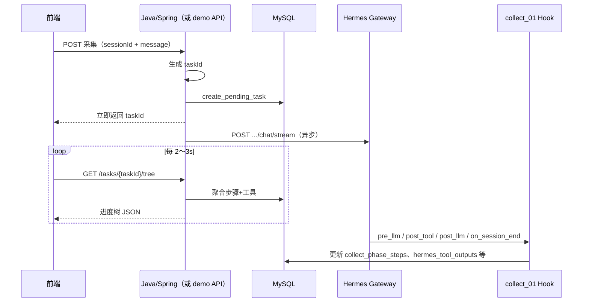

# 账号采集 — 前端深度模式开发指南

> 目标：模仿密塔 AI「深度模式」简易版 — 边采集边出进度树、点节点看详情、同会话可多轮/多次采集。  
> 相关：[gateway-会话与多轮对话指南.md](gateway-会话与多轮对话指南.md) · [MySQL-01账号采集表设计.md](MySQL-01账号采集表设计.md)

---

## 一、我们要干什么

### 1.1 产品目标（简易版密塔）

| 能力 | 说明 |
|------|------|
| 进度树 | 用户发起采集后，页面展示「用户问题 → 步骤节点 → 工具子节点」树状结构 |
| 流式感 | 任务执行过程中节点状态从 `待执行` → `进行中` → `结论明确` 逐步变化（前端轮询即可） |
| 点节点看详情 | 步骤看 `message`/摘要；工具看完整 MCP 入参/出参；结束看三节报告 `summary` |
| 多轮对话 | **同一 `session_id`** 保留 Hermes 上下文；用户不满意可继续提问 |
| 多次采集 | **每次新采集用新 `task_id`**，前端靠 `task_id` 区分各次结果，避免串数据 |

### 1.2 技术约定（已敲定）

```
新对话     → POST /api/sessions → 新 session_id（Hermes 管多轮上下文）
每次采集   → Java 生成 task_id → 预插 hermes_tasks → 调 Gateway chat/stream
同 session  → 可连续多次采集，每次一个新 task_id
同 session  → 同时只允许一个 pending/running 任务（避免 Hook 绑错 task）
落库分工   → Java/Spring 预建任务行；Hook 负责步骤推进、工具、终稿
Gateway 客户端 → 只调 Hermes，不写 MySQL
```

### 1.3 ID 关系（与旧方案的区别）

| 字段 | 生命周期 | 谁生成 |
|------|----------|--------|
| `session_id` | 一次「网页对话」内不变 | Hermes `POST /api/sessions` |
| `task_id` | 每次采集任务一个 UUID | **Java/Spring** |

> 已废弃：`task_id` 当作 `session_id` 建会话的写法（无法支持同会话多次采集）。

---

## 二、架构示意



---

## 三、初版已完成（hermes-xa 仓库内）

### 3.1 后端 / Hook

| 项 | 文件 | 状态 |
|----|------|------|
| session 与 task 分离 | `scripts/collect_01/task_store.py` | ✅ `create_pending_task`、`get_active_task_by_session`、`list_tasks_by_session` |
| Hook 对齐 Java task_id | `scripts/collect_01/sink.py` | ✅ `_resolve_task_id` 优先查 session 下 active 任务 |
| 密塔简易树聚合 | `scripts/collect_01/task_tree.py` | ✅ `build_task_tree`、`get_node_detail` |
| 步骤定义 | `scripts/collect_01/phases.py` | ✅ 已有（`ROOT_STEPS`、`TOOL_PRIMARY_STEP`） |
| 步骤表 | `scripts/sql/005_collect_phase_steps.sql` | ✅ 已有 |
| Gateway 薄客户端 | `clients/hermes-xa/.../gateway/HermesGatewayClient.java` | ✅ |
| Spring REST API | `clients/hermes-xa/.../collect/CollectApiController.java` | ✅ 替代 demo |
| Python demo | `scripts/demo_collect_api.py` | 已废弃 |

### 3.2 已验证能力

- [x] `task_id` 与 `session_id` 分离（Postman 实测通过）
- [x] 同 session 多次采集返回不同 `task_id`
- [x] `GET /api/tasks/{taskId}/tree` 可看到步骤与工具子节点推进
- [x] 工具调用挂到对应步骤的 `children` 下
- [x] 任务进行中 `status: running`，步骤 `pending/running/completed` 正常变化

### 3.3 正式 REST API（Spring Boot `clients/hermes-xa`，端口见 `application.yml`，默认 **4377**）

| 方法 | 路径 | 作用 |
|------|------|------|
| POST | `/api/conversations` | 调 Gateway 建 session，返回 `sessionId` |
| POST | `/api/collect` | 生成 `taskId`、预插库、异步调 Gateway，**立即返回** `taskId` |
| GET | `/api/tasks/{taskId}` | 任务概要 |
| GET | `/api/tasks/{taskId}/tree` | **前端主轮询接口** |
| GET | `/api/tasks/{taskId}/nodes/{nodeId}` | 节点详情（step / tool / summary / user_query） |
| GET | `/api/conversations/{sessionId}/tasks` | 会话下历史 task 列表 |

启动：

```powershell
cd D:\hermes-xa\clients\hermes-xa
mvn spring-boot:run
```

> `scripts/demo_collect_api.py` 已废弃，仅作对照。

### 3.4 Spring 模块结构（`clients/hermes-xa`）

| 包 | 类 | 职责 |
|----|-----|------|
| `gateway` | `HermesGatewayClient` | 建 session、chat/stream |
| `collect.controller` | `CollectApiController` | REST 接口 |
| `collect.service` | `CollectTaskCreateService` | 预建 hermes_tasks |
| `collect.service` | `CollectSubmitService` | 编排提交 |
| `collect.service` | `TaskTreeQueryService` | 进度树 JSON |
| `collect.mapper` | `CollectTaskMapper` + XML | MyBatis 读写 |

---

## 四、前端对接说明（初版）

### 4.1 推荐流程

```
1. POST /api/conversations                    → sessionId（新对话时）
2. POST /api/collect { sessionId, message }   → taskId（立刻展示/开始轮询）
3. 每 2～3s GET /api/tasks/{taskId}/tree      → 渲染树，直到 status 为 completed/failed
4. 用户点击节点 → GET detailRef 对应路径      → 展示详情
5. 同 session 再采集 → 重复 2～4，得到新 taskId
6. 查看会话历史 → GET /api/conversations/{sessionId}/tasks
```

### 4.2 树 JSON 字段说明

| 字段 | 用途 |
|------|------|
| `root` | 根节点：用户问题 |
| `nodes[]` | 主步骤（step1～step6 及动态 step6_post_*） |
| `nodes[].children[]` | 工具子节点 |
| `nodes[].status` / `statusLabel` | 渲染颜色：`pending`/`running`/`completed`/`failed` |
| `summary` | 终稿节点（`msg_type=summary`，任务结束后出现） |
| 顶层 `status` | 任务整体状态，用于停止轮询 |

### 4.3 状态颜色建议

| statusLabel | 含义 |
|-------------|------|
| 结论明确 | completed / 工具 success |
| 进行中 | running |
| 待执行 | pending |
| 信息缺失 | failed |
| 已跳过 | skipped（单平台任务常见） |

---

## 五、还差哪些（待开发清单）

### 5.1 Java / Spring（正式后端，替代 demo API）

| 项 | 说明 | 优先级 |
|----|------|--------|
| 会话表 | 如 `chat_conversations(conversation_id, session_id, user_id, title, ...)` | P0 |
| 采集提交接口 | `CollectSubmitService` + `CollectTaskCreateService` | ✅ 初版完成 |
| 树查询接口 | `TaskTreeQueryService` | ✅ 初版完成 |
| 会话 task 列表 | `list_tasks_by_session` | P1 |
| 鉴权 / 用户隔离 | 按 `user_id` 过滤会话与任务 | P1 |

**Spring 伪代码流程：**

```java
// 新对话
String sessionId = gatewayClient.createSession();
conversationMapper.insert(sessionId, userId);

// 每次采集
String taskId = UUID.randomUUID().toString();
taskMapper.insertPending(taskId, sessionId, message);  // 对齐 create_pending_task
gatewayClient.submitCollectAsync(sessionId, taskId, message, sse -> { /* 可选推 WS */ });
return taskId;
```

### 5.2 前端

| 项 | 说明 | 优先级 |
|----|------|--------|
| 进度树组件 | 消费 `tree` JSON，按 `stepNode` 或顺序排列 | P0 |
| 轮询 + 停止条件 | `status in (completed, failed)` 或 `summary != null` | P0 |
| 步骤业务数据 | 点击步骤主节点调 `GET /api/tasks/{taskId}/steps/{stepKey}/data` | P0 |
| 报告区终稿 | `GET /api/tasks/{taskId}/final-answer`（优先 summary） | P0 |
| 节点详情抽屉/弹层 | 调 `nodes/{id}`（工具入参/出参等） | P0 |
| 会话列表 + 历史 task 卡片 | 同 session 多次采集结果并列展示 | P1 |
| 密塔式布局 | 横向树/时间线/思维导图（UI 自选，数据已够） | P2 |

### 5.3 体验增强（可选）

| 项 | 说明 | 优先级 |
|----|------|--------|
| WebSocket 推送 | Java 消费 Gateway SSE → 推 `tree` 局部更新，减少轮询延迟 | P2 |
| 模型动态拆题（真·密塔 B） | 解析模型输出的子问题树；初版用「步骤+工具」已够用 | P3 |
| 改 hermes-agent | 让 Hook 收到 `gateway_session_key`，可去掉「active task 猜 id」 | P3 |

### 5.4 运维 / 质量

| 项 | 说明 | 优先级 |
|----|------|--------|
| demo API 下线 | Spring 就绪后 `demo_collect_api.py` 仅作本地调试 | P1 |
| 文档同步 | 更新 [gateway-会话与多轮对话指南.md](gateway-会话与多轮对话指南.md) 中「1 对话 = 1 task」表述为「1 对话可 N task」 | P2 |
| 失败态 | 前端对 `status=failed`、409（同 session 有进行中任务）的处理 | P1 |
| 终稿兜底 | `on_session_end` 从 state.db 补 summary（Hook 已有，需保证 Gateway 进程加载最新 hook） | P1 |

---

## 六、关键文件索引

```
clients/hermes-xa/src/main/java/com/example/aw/gateway/HermesGatewayClient.java
clients/hermes-xa/src/main/java/com/example/aw/collect/controller/CollectApiController.java
clients/hermes-xa/src/main/java/com/example/aw/collect/service/
clients/hermes-xa/src/main/resources/mapper/CollectTaskMapper.xml
scripts/collect_01/task_store.py                                     # Hook 侧任务解析
scripts/collect_01/sink.py                                           # Hook 入库
scripts/collect_01/task_tree.py                                      # Python 对照（逻辑已迁 Java）
scripts/sql/003_init_collect_01.sql
scripts/sql/005_collect_phase_steps.sql
config.yaml
```

---

## 七、环境与依赖

| 服务 | 地址 | 说明 |
|------|------|------|
| Hermes Gateway | `http://127.0.0.1:8642` | `hermes gateway` 或等价启动方式 |
| Spring 采集 API | `http://127.0.0.1:4377` | `cd clients/hermes-xa && mvn spring-boot:run` |
| MySQL | `hermes-xa` 库 | `.env` 中 `HERMES_DB_*` |

Hook 配置变更后需重启 Gateway 进程；采集前确认 `config.yaml` 含 `post_llm_call`、`on_session_end`。

---

## 八、已知限制（初版）

1. **Hook 收不到 `X-Hermes-Session-Key`**：靠 Java 预插 + `get_active_task_by_session` 对齐 `task_id`（同 session 禁止并行采集）。
2. **Spring REST 已替代 Python demo**；Postman 请改端口 **4377**。
3. **树为轮询拉取**：非实时 SSE；2～3s 轮询即可满足简易密塔效果。
4. **B 面（动态推理树）未做**：子节点来自工具调用，非模型拆题。

---

## 九、版本记录

| 日期 | 说明 |
|------|------|
| 2026-07-08 | 新增 `steps/{stepKey}/data`、`final-answer` 两个查询接口 |
| 2026-07-08 | Spring `CollectApiController` 替代 demo_collect_api；Maven 编译通过 |
