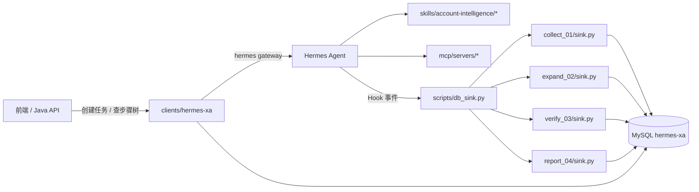

# 项目上下文与四业务速览

> **给新 Cursor 对话用**：开新 Agent 时 `@docs/项目上下文与四业务速览.md`，即可快速理解我们在做什么、四类业务怎么分工、代码在哪改。  
> **Git 分支**：`fox`（不要用 `main`，main 缺 01～04 全栈代码）。  
> **项目根**：`D:\hermes-xa`

---

## 一、我们在做什么

构建 **账号智能分析平台**（类似密塔深度模式）：

1. 用户在前端/Java 后端创建任务，指定种子账号（如 Twitter `@whyyoutouzhele`）
2. **Hermes Agent** 按 Skill 规程自动调 MCP 采集数据
3. **Python db_sink Hook** 监听工具调用，把 profile / 发文 / 候选 / 步骤状态 **写入 MySQL**
4. 前端通过 Java API 展示 **步骤树 + 采集数据 + 终稿报告**

核心原则：**过程数据全部入库**，不依赖聊天记录；Skill 管 Agent 行为，Python sink 管步骤状态与持久化。

---

## 二、架构一张图



| 层 | 目录 | 职责 |
|----|------|------|
| Skill | `skills/account-intelligence/` | Agent 操作手册：步骤顺序、禁止事项、输出格式 |
| MCP | `mcp/` | 真正拉数据：Twitter/YouTube/Maigret/Apify/OCR/Vision |
| Sink | `scripts/collect_01` `expand_02` `verify_03` `report_04` | 工具输出归一化、步骤树状态机、MySQL 入库 |
| Java | `clients/hermes-xa/` | 任务创建、步骤树查询、前端 API |
| 配置 | `config.yaml` + `.env` | 模型、MCP、Hook、数据库、代理 |

**Hook 入口**：`config.yaml` → `hooks` 四处均指向 `scripts/db_sink.py`，按 `task_type` 分发到对应 sink。

---

## 三、四类业务对照表（最重要）

| # | 前端 taskType | 库 task_type | Skill | Python 模块 | 输出 |
|---|---------------|--------------|-------|-------------|------|
| **01 采集** | `collect` | `account_collect` | `account-intelligence-collect` | `scripts/collect_01/` | 三节：个人信息 / 核验依据 / 发文 |
| **02 扩建** | `expand` | `account_expand` | `account-expansion` | `scripts/expand_02/` | 四节：扩建收集 / 多平台采集 / 核查 / 账号 |
| **03 核查** | `verify` | `account_verify` | `account-intelligence-verification` | `scripts/verify_03/` | 三节：基础信息 / 发言观点 / 核验结论 |
| **04 写报** | `report`（`profile` 兼容） | `account_report` | `account-intelligence-report` | `scripts/report_04/` | 四节画像报告（11 步深度模式） |

映射源码：`clients/.../TaskTypeRegistry.java`

---

## 四、四类业务分别是什么

### 01 · 账号信息采集（collect）

**场景**：给一个种子账号，自动跨平台发现关联账号，采集主页+发文，输出结构化采集报告。

**Agent 步骤（Skill 6+1 步）**：

| 步 | 内容 |
|----|------|
| 1 | 种子 MCP profile |
| 2 | Maigret 跨平台发现 |
| 3 | 各候选主页 MCP 或 Apify |
| 4 | 文本流 + 图片流 vs 种子 |
| 5 | 收敛 `validated_accounts` |
| 6 | 对可信账号采发文 |
| 7 | 一次输出三节 |

**步骤树（6 根步骤）**：`step1_seed` → `step2_cross_platform` → `step3_profiles`（子节点按平台）→ 流核查 → `step5_validated` → `step6_posts`

**特点**：禁止 `web_search`；禁止中途 clarify；单平台模式可跳过 Maigret。

**关键文件**：
- `skills/.../account-intelligence-collect/SKILL.md`
- `skills/.../references/collect-rules.yaml`
- `scripts/collect_01/sink.py` `phases.py` `task_store.py`

---

### 02 · 账号扩建（expand）

**场景**：从单个种子向外扩建，发现+采集+核查，输出 HIGH 相似度关联账号。

**Agent 步骤（5+1 步）**：

| 步 | 内容 |
|----|------|
| 1 | 种子 profile |
| 2 | Maigret 发现 |
| 3 | **按平台顺序**逐个采 profile + 发文（同一步内） |
| 4 | 文本流 + 图片流（头像 OCR+vision）核查 |
| 5 | 仅 HIGH 纳入第四节 |
| 6 | 一次输出四节 |

**步骤树（5 根步骤）**：与 01 类似但语义映射到四节输出；发文挂在 `step3_profiles` 下而非独立 step6。

**特点**：禁止 web_search；步骤 3 禁止只先跑单平台发文。

**关键文件**：
- `skills/.../account-expansion/SKILL.md`
- `skills/.../references/expansion-rules.yaml`
- `scripts/expand_02/`

---

### 03 · 账号核查（verify）

**场景**：用户一次给**多个**种子账号（多平台），采集各自主页+近 31 天发文，做多维度比对，输出核查报告。

**Agent 步骤（6+1 步）**：

| 步 | 内容 |
|----|------|
| 1 | 确认多个种子账号 |
| 2 | 各账号主页采集 |
| 3 | 各账号发文采集（31 天） |
| 4 | 发文风格与领域归纳 |
| 5 | 文字流 + 图片流比对 |
| 6 | 匹配验证与原因说明 |
| 7 | 一次输出三节报告 |

**步骤树（5 根步骤）**：`step1_input_accounts` → `step3_profiles`（主页+发文合一）→ 流分析 → `step5_validated`

**特点**：多种子并行；每步必须完整展示采集结果，不压缩。

**关键文件**：
- `skills/.../account-intelligence-verification/SKILL.md`
- `scripts/verify_03/`

---

### 04 · 画像写报（report）— **当前主攻**

**场景**：深度模式画像报告。在采集+核查基础上，增加网页检索候选、90 天发文、图片/观点/PII 三层分析，最终输出完整画像。

**Agent 步骤（11 步）**：

| 步 | 内容 |
|----|------|
| 1 | 种子 profile |
| 2 | Maigret 候选 |
| 3 | **web_search / browser** 补充候选（仅本步允许） |
| 4 | 各候选主页采集（子节点 `step4_profile_{platform}`） |
| 5 | 文本/图片流核查 |
| 6 | `validated_accounts` 相似账号认定 |
| 7 | 发文采集（子节点 `step7_post_{platform}`，90 天） |
| 8 | 图片流分析 |
| 9 | 观点与涉华分析 |
| 10 | PII 与圈层分析 |
| 11 | 终稿画像报告（四章节） |

**步骤树（11 根步骤）**：Java `ReportTaskCreateService` 预建；步骤 4、7 有按平台动态子节点。

**关键文件**：
- `skills/.../account-intelligence-report/SKILL.md`
- `skills/.../references/collect-rules.yaml`
- `scripts/report_04/`（`sink.py` `phases.py` `gates.py` `step_reconcile.py` `task_store.py`）
- `clients/.../ReportTaskCreateService.java`

---

## 五、04 写报步骤流转硬约束（修 bug 必看）

近期在 fox 分支修复了步骤乱序问题，**新对话改 report_04 时必须遵守**：

| 规则 | 说明 |
|------|------|
| step4 子节点物化 | 仅 step2+3 完成后 `materialize_step4_from_candidates()` |
| step3 门禁 | **必须 step2 completed/skipped 后**才允许 web_search/browser 推进 step3 |
| step2 Maigret | 任意 `mcp_maigret_*` 标 running；有候选或 `collect_accounts` 后 completed |
| 不可采集平台 | Maigret 返回的 imginn/picuki 等无 MCP 通道 → `skipped`，不能永远 `pending` |
| step4 父节点收口 | 所有子节点 terminal 后才 `completed` |
| step5 vision | 可提前执行并标 `running`，但 `completed` 需 step4 完成 + 图片流就绪 |
| step7 门禁 | **必须 step6 `completed` 后**才 `materialize_step7`、更新发文子节点 |
| POST 工具 phase | step6 前调用 `get_user_tweets` 等不得把 step7 标 `running` |
| Apify dataset | step6 前拉 dataset 挂 `step4_profile_*`，不是 `step7_post_*` |
| step11 | 须 step8～10 完成后才能终稿；终稿时先回填 8～10 display |

核心模块：
- `report_04/gates.py` — 步骤完成门禁
- `report_04/step_reconcile.py` — 卡死恢复、子节点收口
- `report_04/sink.py` — Hook 主逻辑、工具 phase 路由

---

## 六、当前开发进度（截至 2026-07-10）

| 模块 | 状态 |
|------|------|
| 01 collect 全栈 | ✅ 可用 |
| 02 expand 全栈 | ✅ 可用（步骤树与 01 有差异） |
| 03 verify 全栈 | ✅ 已接入 |
| 04 report 全栈 | 🔄 **不稳定版**（`6b0d227`），步骤流转在持续修 |
| Java 四类型注册 | ✅ `TaskTypeRegistry` + 各 `*TaskCreateService` |
| MySQL 表 | 复用 collect 系列表 + `collect_display_records` |

**正在做**：04 写报步骤顺序、imginn 阻塞 step4、step7 抢跑、vision 被 step5 门禁挡住等问题。

**调试方式**：
- 日志：`logs/report_04_sink.log`、`logs/collect_01_sink.log`
- MySQL：`collect_phase_steps`（步骤树）、`hermes_tool_outputs`（工具调用）
- 修任务：`report_04.step_reconcile.reconcile_stuck_pipeline(store, task_id)`

---

## 七、改代码速查（Agent 按任务类型找文件）

```
想改 Agent 行为（步骤/禁止/输出）  →  skills/account-intelligence/*/SKILL.md
想改步骤状态 / 入库逻辑          →  scripts/{collect_01|expand_02|verify_03|report_04}/sink.py
想改步骤定义 / 工具归属            →  scripts/*/phases.py
想改步骤能否推进                  →  scripts/*/gates.py
想改卡死恢复 / 子节点收口          →  scripts/*/step_reconcile.py
想改任务创建 / 预建步骤树          →  clients/.../ *TaskCreateService.java
想改前端 API / 步骤树查询          →  clients/.../CollectApiController.java
想改 MCP 连接                     →  mcp/mcp_servers.yaml → mcp/install.ps1
```

**公共依赖**：`scripts/collect_01/db.py`（MySQL）、`display_store.py`（展示层）、`normalizers/`（工具输出解析）

---

## 八、常用 MCP 工具

| 平台 | 主页 | 发文 |
|------|------|------|
| Twitter | `mcp_twitter_get_user_info` | `mcp_twitter_get_user_tweets` |
| YouTube | `mcp_youtube_get_channel_stats` | `mcp_youtube_analyze_channel_videos` |
| 微博 | `mcp_weibo_get_profile` | `mcp_weibo_get_user_feeds` |
| Instagram/Telegram/GitHub 等 | Apify Actor → `get_actor_run` → `get_dataset_items` | 同上或专用 Actor |
| 跨平台发现 | `mcp_maigret_collect_accounts` | — |
| 图片 | `mcp_ocr_perform_ocr` + `vision_analyze` | — |
| 04 专用 | `web_search` / `browser_*`（仅 step3） | — |

---

## 九、新对话推荐起手式

```text
我在 hermes-xa 项目 fox 分支上开发。
请先阅读 @docs/项目上下文与四业务速览.md
然后帮我 [具体任务，例如：检查 task_id=xxx 的步骤四为什么 pending]
```

按业务附加 Skill：

```text
@skills/account-intelligence/account-intelligence-report/SKILL.md
@scripts/report_04/sink.py
```

---

## 十、相关文档

| 文档 | 用途 |
|------|------|
| [平台总览与框架设计.md](./平台总览与框架设计.md) | 架构与目录地图 |
| [笔记本迁移与对齐指南.md](./笔记本迁移与对齐指南.md) | 新机器环境对齐 |
| [协作者本地环境搭建指南.md](./协作者本地环境搭建指南.md) | 安装 MCP、依赖 |
| [workflows/01-账号信息采集.md](./workflows/01-账号信息采集.md) | 01 业务流程细节 |

---

## 十一、术语表

| 术语 | 含义 |
|------|------|
| 种子账号 | 用户指定的起始账号（如 Twitter `@xxx`） |
| 候选账号 | Maigret / web_search 发现的潜在新账号 |
| validated_accounts | 流核查后认定的相似/可信账号 |
| 文本流 | 昵称、简介、发文文本等比对 |
| 图片流 | 头像 OCR + vision 比对 |
| display_records | 前端展示用结构化数据（步骤 8～10 分析结果） |
| terminal 状态 | `completed` / `skipped` / `failed`（非 pending/running） |
